## 1. 2-Input AND Gate (`AND2`)

The `AND2` standard cell is implemented by cascading a static CMOS NAND2 gate followed by an Inverter (NOT) buffer stage on the IHP SG13G2 (130nm BiCMOS) PDK.

---

### 1.1. Schematic & Physical Layout

* **Transistor Sizing:** PMOS ($W = 0.15\,\mu\text{m}, L = 0.13\,\mu\text{m}$), NMOS ($W = 0.15\,\mu\text{m}, L = 0.13\,\mu\text{m}$).
* **Physical Layout:** Full-custom layout with continuous power rails ($V_{DD}$, $V_{SS}$) and N-well tap integration, achieving 100% DRC & LVS clean verification.

| Transistor-Level Schematic | Full-Custom Layout (`AND2.gds`) |
| :---: | :---: |
|  |  |

* **Cell Dimensions:** `[Width W] 4.060172 µm` × `[Height H] 3.7130014 µm`
* **Silicon Area:** `[W x H] 15.07542432 µm² = (15.07542432e-12)m²`

---

#### Physical Verification (DRC & LVS)
* **DRC (Design Rule Check):** 0 errors / 100% clean verification on IHP SG13G2 rules.
* **LVS (Layout Versus Schematic):** Netlists matched completely.

| DRC Clean Verification | LVS Clean Verification |
| :---: | :---: |
|  |  |

### 1.2. Pre-Layout vs. Post-Layout Testbench Setup

* **Operating Conditions:** $V_{DD} = 1.7\text{ V}$, $T = 27^\circ\text{C}$, Typical Corner (`cornerMOSlv.lib mos_tt`).
* **Input Stimuli:** 
  * $V_A$: Pulse ($0\text{ V} \to 1.7\text{ V}$, Period $= 20\text{ ns}$, Pulse Width $= 10\text{ ns}$, $t_r = t_f = 70\text{ ps}$).
  * $V_B$: Pulse ($0\text{ V} \to 1.7\text{ V}$, Period $= 10\text{ ns}$, Pulse Width $= 5\text{ ns}$, $t_r = t_f = 70\text{ ps}$).

| Pre-Layout Testbench (`TEST_PRE.sch`) | Post-Layout Testbench (`TEST_POST.sch`) |
| :---: | :---: |
|  |  |

---

### 1.3. Transient Simulation Results

| Pre-Layout Transient Waveform | Post-Layout (PEX) Transient Waveform |
| :---: | :---: |
|  |  |

---

### 1.4. Timing & Propagation Delay Characterization

Propagation delays are measured at the $50\%$ logic transition threshold ($V_{DD}/2 = 0.85\text{ V}$):

#### A. Low-to-High Propagation Delay ($t_{pLH}$)
Propagation delay when output change from low - high ($0 \to 1$):

| Pre-Layout $t_{pLH}$ Waveform | Post-Layout (PEX) $t_{pLH}$ Waveform |
| :---: | :---: |
|  |  |

* **Pre-Layout $t_{pLH}$:** `30 ps`
* **Post-Layout $t_{pLH}$:** `40 ps`
* **$\Delta t_{pLH}$ (Parasitic Delay Impact):** `+10 ps`

---

#### B. High-to-Low Propagation Delay ($t_{pHL}$)
Propagation delay when output change from high - low ($1 \to 0$):

| Pre-Layout $t_{pHL}$ Waveform | Post-Layout (PEX) $t_{pHL}$ Waveform |
| :---: | :---: |
|  |  |

* **Pre-Layout $t_{pHL}$:** `40 ps`
* **Post-Layout $t_{pHL}$:** `40 ps`
* **$\Delta t_{pHL}$ (Parasitic Delay Impact):** `+0 ps`

---

#### C. Summary Timing & Characterization Table

| Timing Metric | Pre-Layout (Ideal) | Post-Layout (PEX) | Parasitic Delta ($\Delta$) | Unit |
| :--- | :---: | :---: | :---: | :---: |
| **Low-to-High Delay ($t_{pLH}$)** | `30` | `40` | `+10` | ps |
| **High-to-Low Delay ($t_{pHL}$)** | `40` | `40` | `+0` | ps |
| **Average Propagation Delay ($t_{pd}$)** | `35` | `40` | `+5` | ps |

## 2. 2-Input OR Gate (`OR2`)

The `OR2` standard cell is implemented by cascading a static CMOS NOR2 gate followed by an Inverter (NOT) buffer stage on the IHP SG13G2 (130nm BiCMOS) PDK.

---

### 2.1. Schematic & Physical Layout

* **Transistor Sizing:** PMOS ($W = 0.15\,\mu\text{m}, L = 0.13\,\mu\text{m}$), NMOS ($W = 0.15\,\mu\text{m}, L = 0.13\,\mu\text{m}$).
* **Physical Layout:** Full-custom layout with continuous power rails ($V_{DD}, V_{SS}$) and N-well tap integration.

| Transistor-Level Schematic | Full-Custom Layout (`OR2.gds`) |
| :---: | :---: |
| 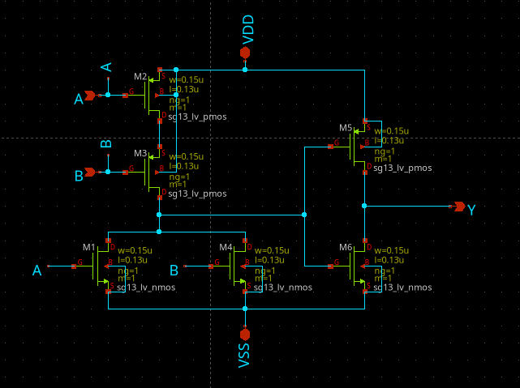 | 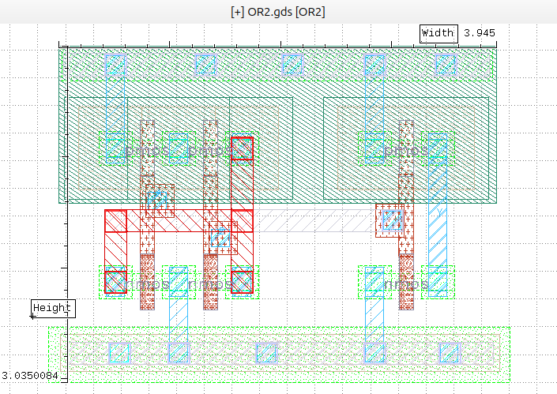 |

* **Cell Dimensions:** `[Width W] 3.945 µm` × `[Height H] 3.0050084 µm`
* **Silicon Area:** `[W x H] 11.8548 µm² = 11.8548e-12 m²`

#### Physical Verification (DRC & LVS)
* **DRC (Design Rule Check):** 0 errors / 100% clean verification on IHP SG13G2 rules.
* **LVS (Layout Versus Schematic):** Netlists matched completely with zero topology or device property discrepancies.

| DRC Clean Verification | LVS Clean Verification |
| :---: | :---: |
| 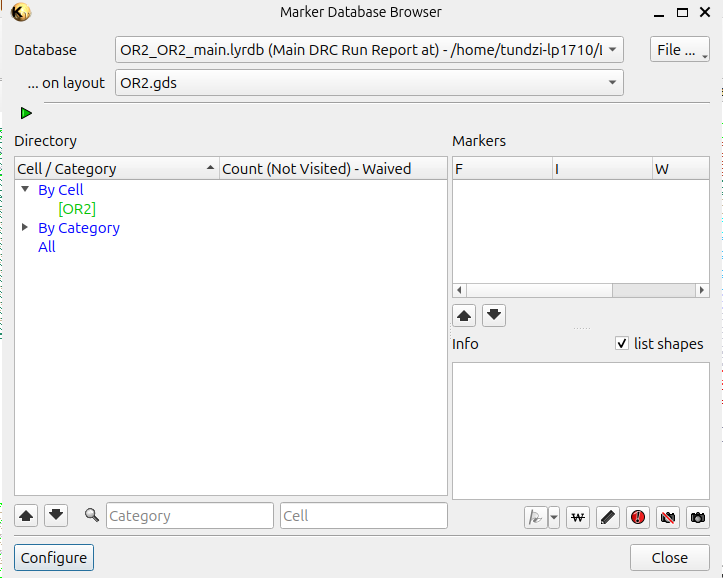 | 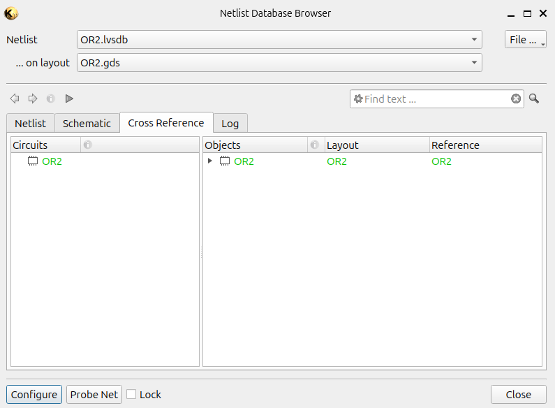 |

---

### 2.2. Pre-Layout vs. Post-Layout Testbench Setup

* **Operating Conditions:** $V_{DD} = 2.1\text{ V}$, $T = 27^\circ\text{C}$, Typical Corner (`cornerMOSlv.lib mos_tt`).
* **Input Stimuli:** 
  * $V_A$: Pulse ($0\text{ V} \to 2.1\text{ V}$, Period $= 20\text{ ns}$, Pulse Width $= 10\text{ ns}$, $t_r = t_f = 50\text{ ps}$).
  * $V_B$: Pulse ($0\text{ V} \to 2.1\text{ V}$, Period $= 40\text{ ns}$, Pulse Width $= 20\text{ ns}$, $t_r = t_f = 50\text{ ps}$).

| Pre-Layout Testbench (`TEST_PRE.sch`) | Post-Layout Testbench (`TEST_POST.sch`) |
| :---: | :---: |
| 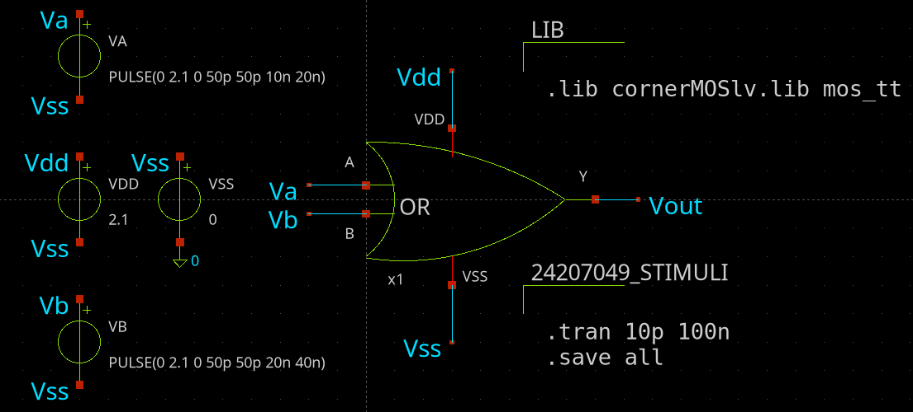 | 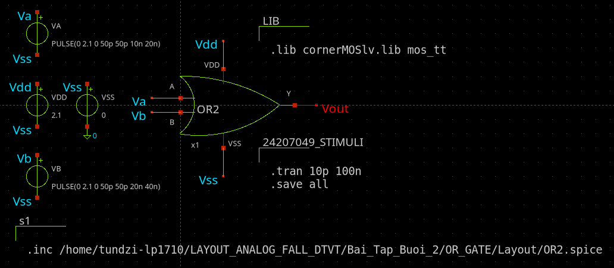 |

---

### 2.3. Transient Simulation Results

| Pre-Layout Transient Waveform | Post-Layout (PEX) Transient Waveform |
| :---: | :---: |
| 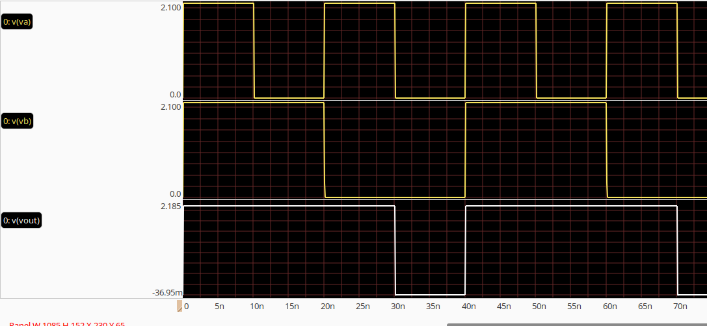 | 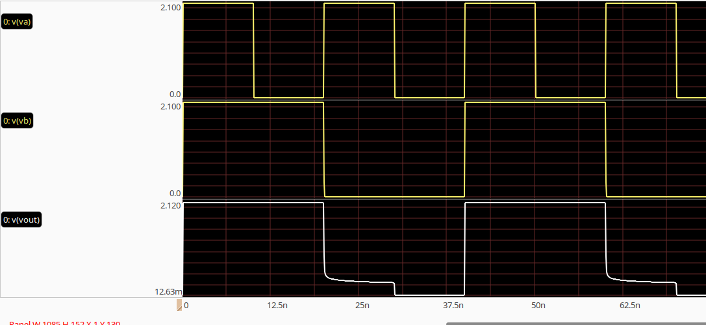 |

#### Observed Phenomenon
* During post-layout (PEX) transient simulation of the `OR2` gate, a voltage shelf/plateau appears along the falling edge of $v(vout)$ rather than a sharp transition down to $0\text{ V}$.
* **Root Cause:**
  1. **Series PMOS Topology:** The `OR2` cell incorporates a `NOR2` stage comprising two PMOS transistors stacked in series between $V_{DD}$ and the internal node. Because hole mobility is significantly lower than electron mobility ($\mu_n \approx 2\text{--}3\mu_p$), stacking PMOS devices doubles the effective pull-up channel resistance ($R_{pull-up} \approx 2 R_p$).
  2. **Internal Node Charge Sharing & Trapping:** With minimum symmetric sizing ($W_p = W_n = 0.15\,\mu\text{m}$), the weak current drive cannot rapidly discharge the parasitic junction capacitance ($C_j$) accumulated at the floating intermediate node between the two series PMOS transistors. This trapped charge slowly redistributes into the input gate of the subsequent Inverter buffer stage, stalling the output falling transition.

---

#### Proposed Mitigation & Optimization Strategies

1. **PMOS Transistor Upsizing ($W_p / W_n$ Sizing Optimization):**
   * Increase the PMOS channel width in the NOR2 stage to an optimal sizing ratio:
     $$\frac{W_p}{W_n} \approx 3 \sim 4 \quad \Rightarrow \quad W_p \approx 0.45\,\mu\text{m} \sim 0.60\,\mu\text{m}$$
   * **Impact:** Drastically reduces $R_{pull-up}$, enhances charging/discharging current at the internal parasitic node, eliminates the step plateau, and balances symmetric propagation delays ($t_{pLH} \approx t_{pHL}$).

2. **Diffusion Sharing in Physical Layout:**
   * Abut the two series-connected PMOS devices using a continuous, shared Source/Drain active area instead of bridging them with Metal-1 contacts.
   * **Impact:** Eliminates extra contact pads and cuts intermediate diffusion area/perimeter by more than 50%, reducing parasitic junction capacitance ($C_j$) and interconnect load.
---

### 2.4. Propagation Delay Measurements & Waveforms

Propagation Delay Measure in $50\%$ of Power Supply ($V_{DD}/2 = 1.2\text{ V}$) between changing state of ON and OFF:

#### A. Low-to-High Propagation Delay ($t_{pLH}$)
Propagation delay from low to high ($0 \to 1$):

| Pre-Layout $t_{pLH}$ Waveform | Post-Layout (PEX) $t_{pLH}$ Waveform |
| :---: | :---: |
| 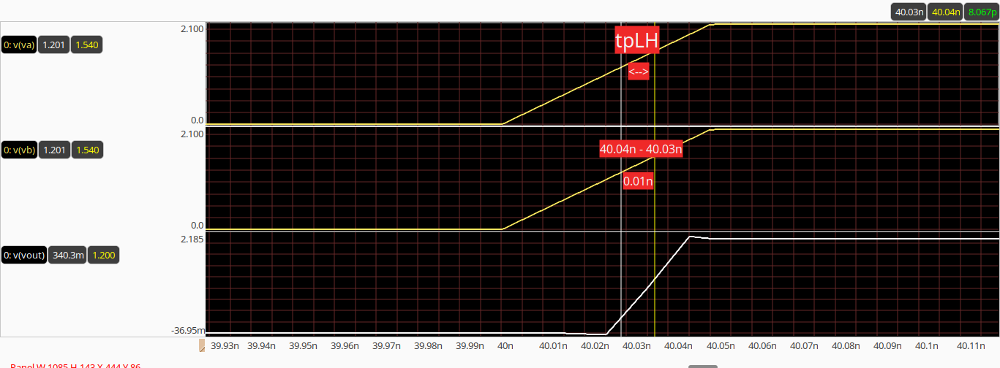 | 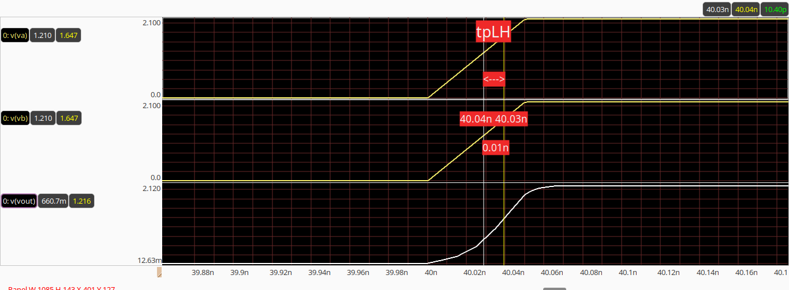 |

* **Pre-Layout $t_{pLH}$:** `10 ps`
* **Post-Layout $t_{pLH}$:** `10 ps`
* **$\Delta t_{pLH}$ (Parasitic Delay Impact):** `+0 ps`

---

#### B. High-to-Low Propagation Delay ($t_{pHL}$)
Propagation delay from high to low ($1 \to 0$):

| Pre-Layout $t_{pHL}$ Waveform | Post-Layout (PEX) $t_{pHL}$ Waveform |
| :---: | :---: |
| 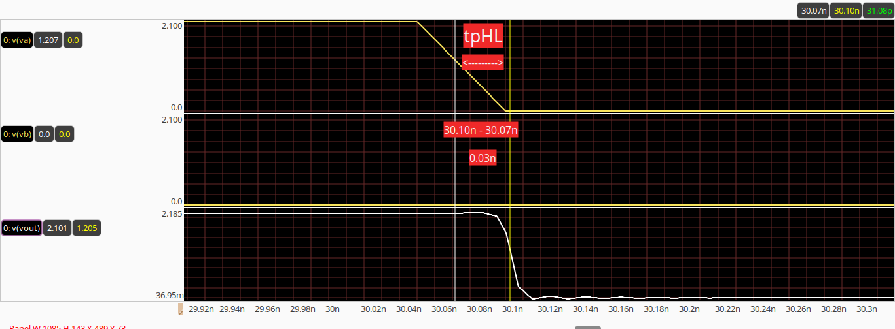 | 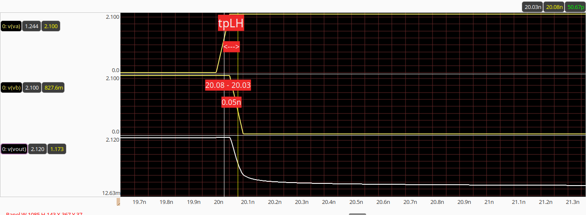 |

* **Pre-Layout $t_{pHL}$:** `30 ps`
* **Post-Layout $t_{pHL}$:** `50 ps`
* **$\Delta t_{pHL}$ (Parasitic Delay Impact):** `+20 ps`

---

#### C. Summary Timing & Characterization Table

| Timing Metric | Pre-Layout (Ideal) | Post-Layout (PEX) | Parasitic Delta ($\Delta$) | Unit |
| :--- | :---: | :---: | :---: | :---: |
| **Low-to-High Delay ($t_{pLH}$)** | `10` | `10` | `0` | ps |
| **High-to-Low Delay ($t_{pHL}$)** | `30` | `50` | `+20` | ps |
| **Average Propagation Delay ($t_{pd}$)** | `20` | `30` | `+10` | ps |

## 3. 2-Input NAND Gate (`NAND2`)

The `NAND2` standard cell is implemented using a complementary static CMOS topology consisting of two parallel PMOS pull-up transistors and two series-stacked NMOS pull-down transistors fabricated on the IHP SG13G2 (130nm BiCMOS) process.

---

### 3.1. Schematic & Physical Layout

* **Transistor Sizing:** PMOS ($W = 0.15\,\mu\text{m}, L = 0.13\,\mu\text{m}$), NMOS ($W = 0.15\,\mu\text{m}, L = 0.13\,\mu\text{m}$).
* **Physical Layout:** Full-custom standard cell layout featuring continuous supply rails ($V_{DD}, V_{SS}$), shared active diffusion regions to minimize parasitic junction area, and integrated well/substrate taps.

| Transistor-Level Schematic | Full-Custom Layout (`NAND2.gds`) |
| :---: | :---: |
| 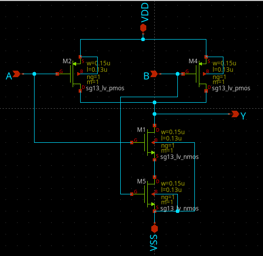 | 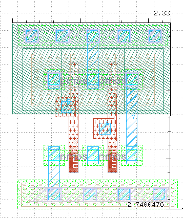 |

* **Cell Dimensions:** `[Width W] 2.33µm` × `[Height H] 2.7400476µm`
* **Silicon Area:** `[W x H] 6.3843µm²`

#### Physical Verification (DRC & LVS)
* **DRC (Design Rule Check):** 0 errors / 100% clean verification on IHP SG13G2 rules.
* **LVS (Layout Versus Schematic):** Netlists matched completely with zero topology or device property discrepancies.

| DRC Clean Verification | LVS Clean Verification |
| :---: | :---: |
| 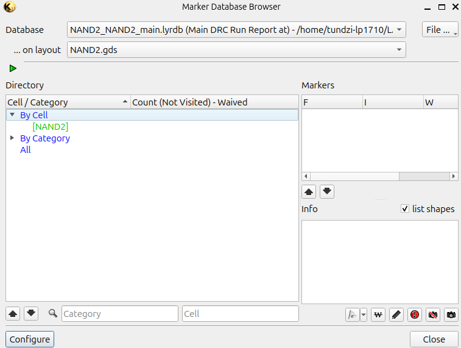 | 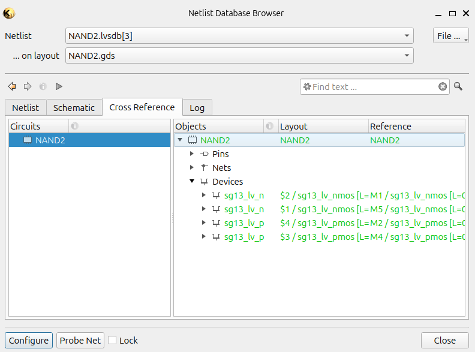 |

---

### 3.2. Pre-Layout vs. Post-Layout Testbench Setup

* **Operating Conditions:** $V_{DD} = 1.2\text{ V}$, $T = 27^\circ\text{C}$, Typical Corner (`cornerMOSlv.lib mos_tt`).
* **Input Stimuli:** 
  * $V_A$: Pulse ($0\text{ V} \to 1.2\text{ V}$, Period $= 20\text{ ns}$, Pulse Width $= 10\text{ ns}$, $t_r = t_f = 100\text{ ps}$).
  * $V_B$: Pulse ($0\text{ V} \to 1.2\text{ V}$, Period $= 40\text{ ns}$, Pulse Width $= 20\text{ ns}$, $t_r = t_f = 100\text{ ps}$).

| Pre-Layout Testbench (`TEST_PRE.sch`) | Post-Layout Testbench (`TEST_POST.sch`) |
| :---: | :---: |
| 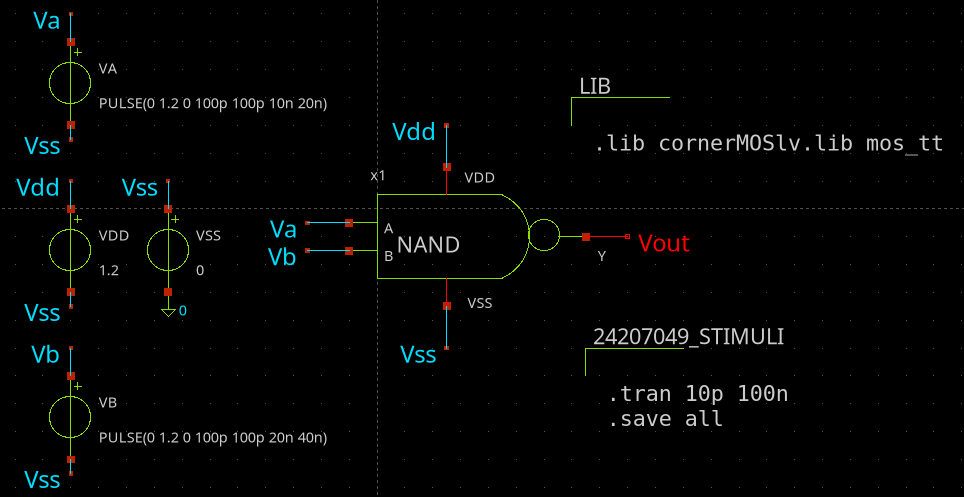 | 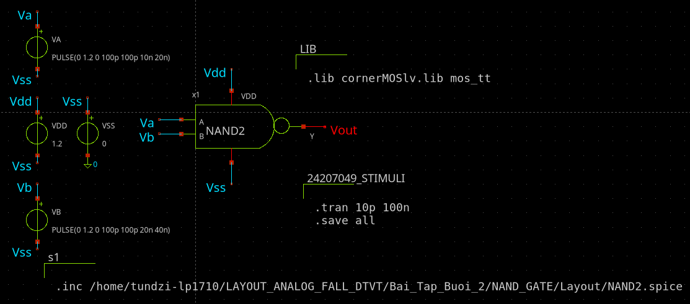 |

---

### 3.3. Transient Simulation Results

| Pre-Layout Transient Waveform | Post-Layout (PEX) Transient Waveform |
| :---: | :---: |
| 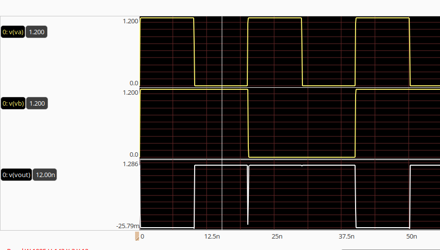 | 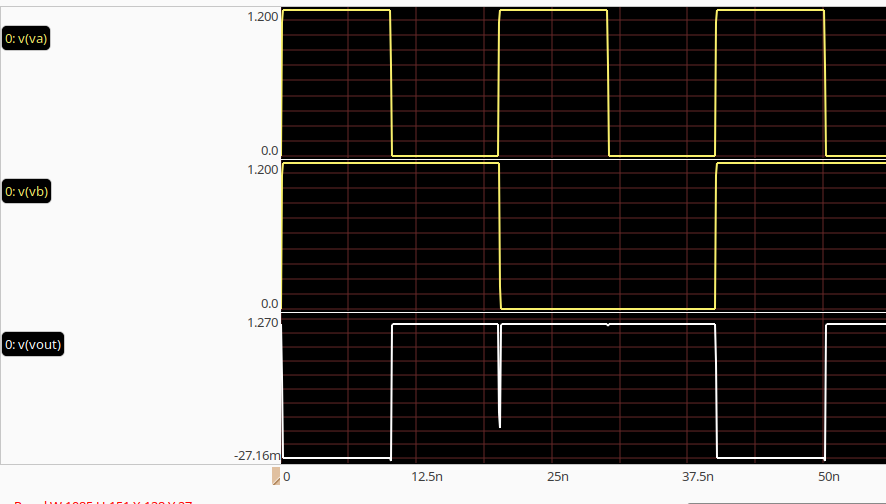 |

---

### 3.4. Propagation Delay Measurements & Waveforms

Propagation delays are measured at the $50\%$ logic transition threshold ($V_{DD}/2 = 0.85\text{ V}$) between the triggering input and output switching:

#### A. Low-to-High Propagation Delay ($t_{pLH}$)
Measured when the output transitions from low to high ($0 \to 1$):

| Pre-Layout $t_{pLH}$ Waveform | Post-Layout (PEX) $t_{pLH}$ Waveform |
| :---: | :---: |
| 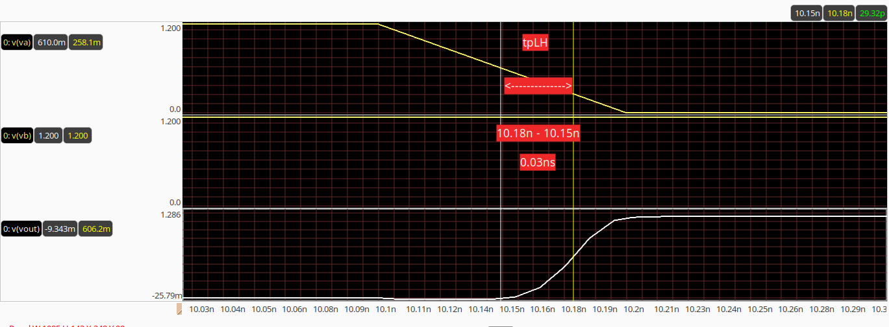 | 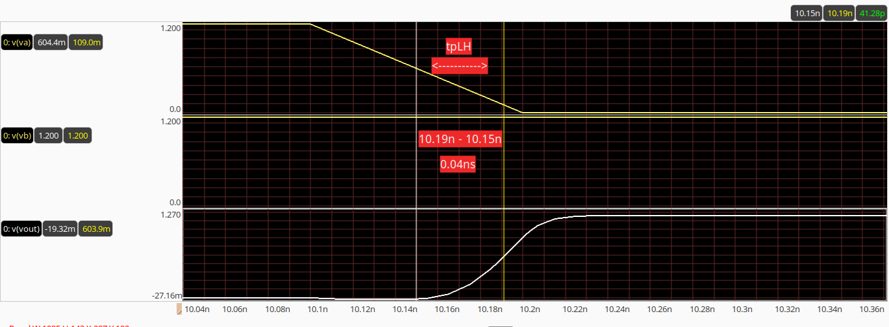 |

* **Pre-Layout $t_{pLH}$:** `30 ps`
* **Post-Layout $t_{pLH}$:** `40 ps`
* **$\Delta t_{pLH}$ (Parasitic Delay Impact):** `+10 ps`

---

#### B. High-to-Low Propagation Delay ($t_{pHL}$)
Measured when the output transitions from high to low ($1 \to 0$):

| Pre-Layout $t_{pHL}$ Waveform | Post-Layout (PEX) $t_{pHL}$ Waveform |
| :---: | :---: |
| 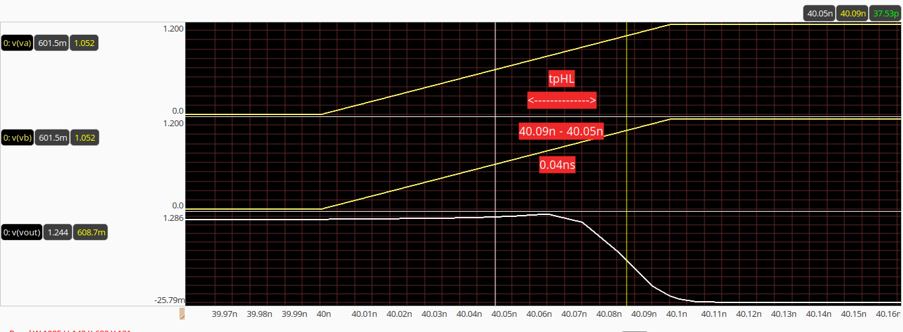 | 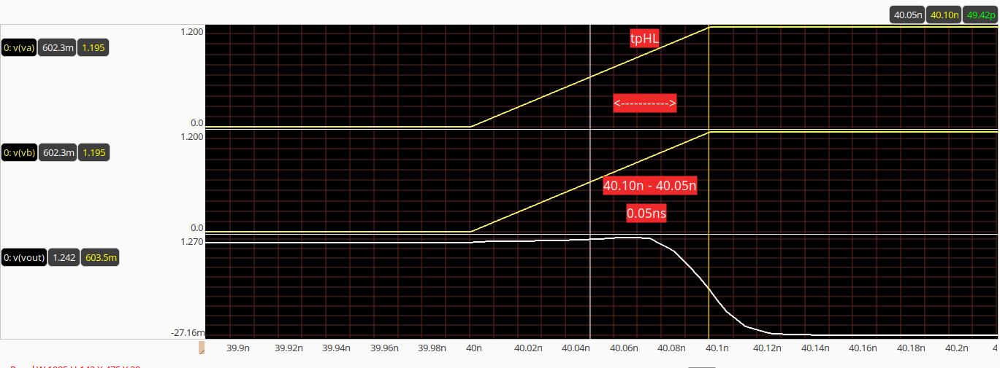 |

* **Pre-Layout $t_{pHL}$:** `40 ps`
* **Post-Layout $t_{pHL}$:** `50 ps`
* **$\Delta t_{pHL}$ (Parasitic Delay Impact):** `+10 ps`

---

#### C. Summary Timing & Characterization Table

| Timing Metric | Pre-Layout (Ideal) | Post-Layout (PEX) | Parasitic Delta ($\Delta$) | Unit |
| :--- | :---: | :---: | :---: | :---: |
| **Low-to-High Delay ($t_{pLH}$)** | `30` | `40` | `+10` | ps |
| **High-to-Low Delay ($t_{pHL}$)** | `40` | `50` | `+10` | ps |
| **Average Propagation Delay ($t_{pd}$)** | `35` | `45` | `+10` | ps |

---

## 4. 2-Input NOR Gate (`NOR2`)

The `NOR2` standard cell is implemented using a complementary static CMOS topology with two PMOS transistors connected in series (pull-up network) and two NMOS transistors connected in parallel (pull-down network) fabricated on the IHP SG13G2 (130nm BiCMOS) process.

---

### 4.1. Schematic & Physical Layout

* **Transistor Sizing:** PMOS ($W = 0.15\,\mu\text{m}, L = 0.13\,\mu\text{m}$), NMOS ($W = 0.15\,\mu\text{m}, L = 0.13\,\mu\text{m}$).
* **Physical Layout:** Full-custom standard cell layout featuring continuous supply rails ($V_{DD}, V_{SS}$), shared active diffusion regions to minimize parasitic junction area, and integrated well/substrate taps.

| Transistor-Level Schematic | Full-Custom Layout (`NOR2.gds`) |
| :---: | :---: |
| 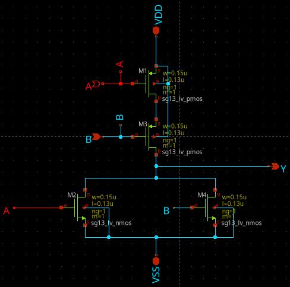 | 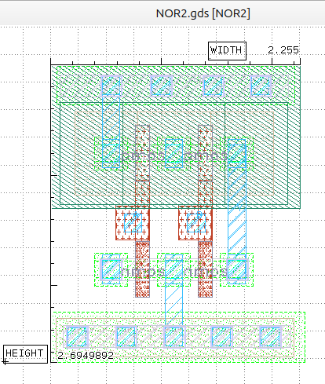 |

* **Cell Dimensions:** `[Width W] 2.255µm` × `[Height H] 2.6949892µm`
* **Silicon Area:** `[W x H] 6.0321µm²`

#### Physical Verification (DRC & LVS)
* **DRC (Design Rule Check):** 0 errors / 100% clean verification on IHP SG13G2 rules.
* **LVS (Layout Versus Schematic):** Netlists matched completely with zero topology or device property discrepancies.

| DRC Clean Verification | LVS Clean Verification |
| :---: | :---: |
| 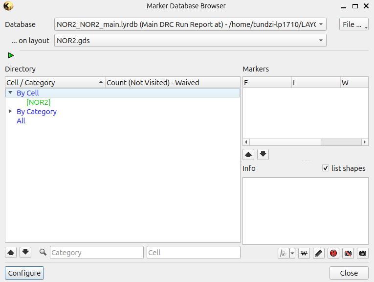 | 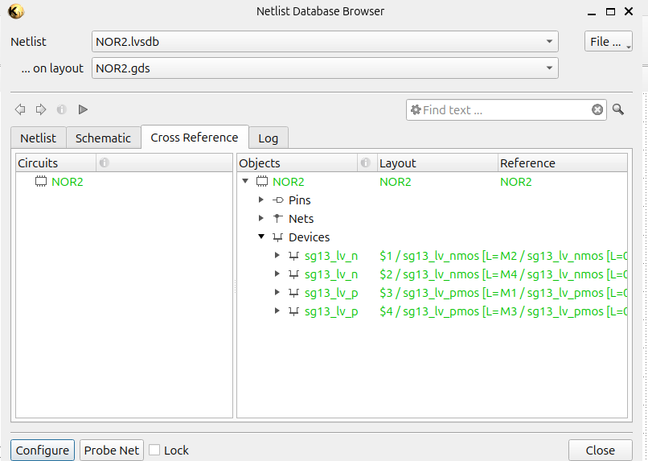 |

---

### 4.2. Pre-Layout vs. Post-Layout Testbench Setup

* **Operating Conditions:** $V_{DD} = 1.2\text{ V}$, $T = 27^\circ\text{C}$, Typical Corner (`cornerMOSlv.lib mos_tt`).
* **Input Stimuli:** 
  * $V_A$: Pulse ($0\text{ V} \to 1.2\text{ V}$, Period $= 40\text{ ns}$, Pulse Width $= 20\text{ ns}$, $t_r = t_f = 100\text{ ps}$).
  * $V_B$: Pulse ($0\text{ V} \to 1.2\text{ V}$, Period $= 20\text{ ns}$, Pulse Width $= 10\text{ ns}$, $t_r = t_f = 100\text{ ps}$).

| Pre-Layout Testbench (`TEST_PRE.sch`) | Post-Layout Testbench (`TEST_POST.sch`) |
| :---: | :---: |
| 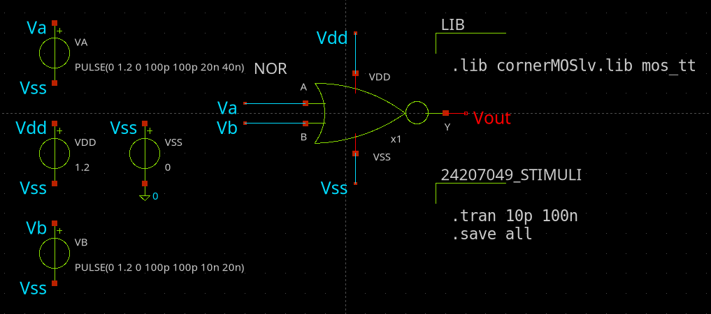 | 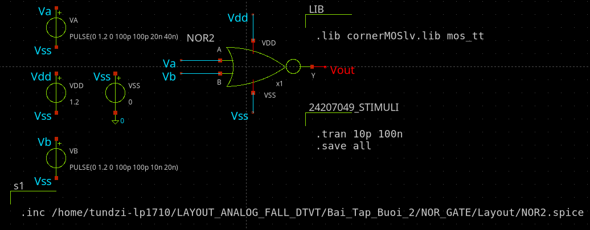 |

---

### 4.3. Transient Simulation Results

| Pre-Layout Transient Waveform | Post-Layout (PEX) Transient Waveform |
| :---: | :---: |
| 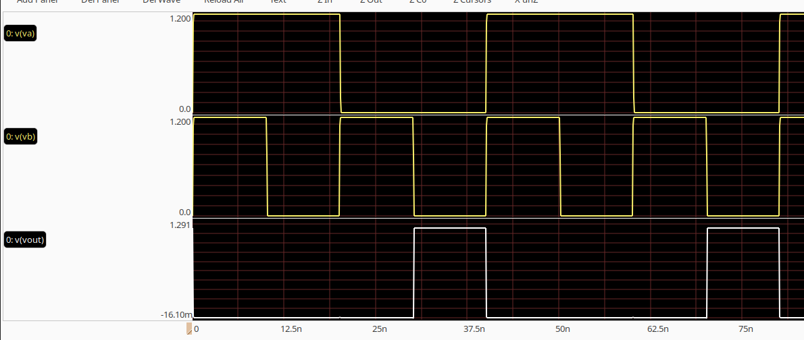 | 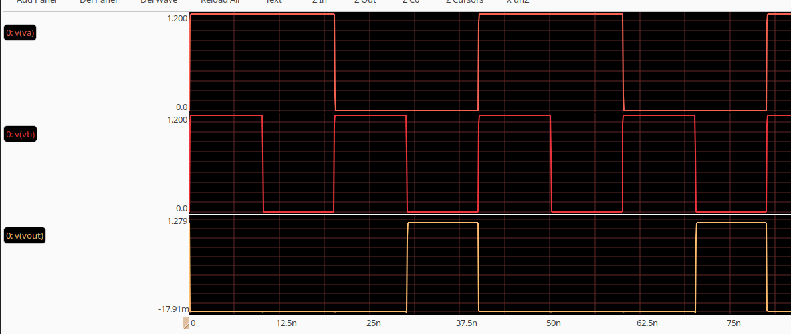 |

---

### 4.4. Propagation Delay Measurements & Waveforms

Propagation delays are measured at the $50\%$ logic transition threshold ($V_{DD}/2 = 0.6\text{ V}$) between the triggering input edge and the output response:

#### A. Low-to-High Propagation Delay ($t_{pLH}$)
Measured when the output transitions from low to high ($0 \to 1$):

| Pre-Layout $t_{pLH}$ Waveform | Post-Layout (PEX) $t_{pLH}$ Waveform |
| :---: | :---: |
| 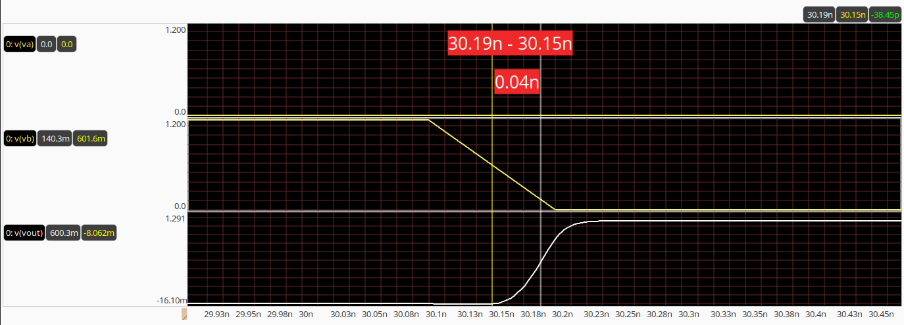 | 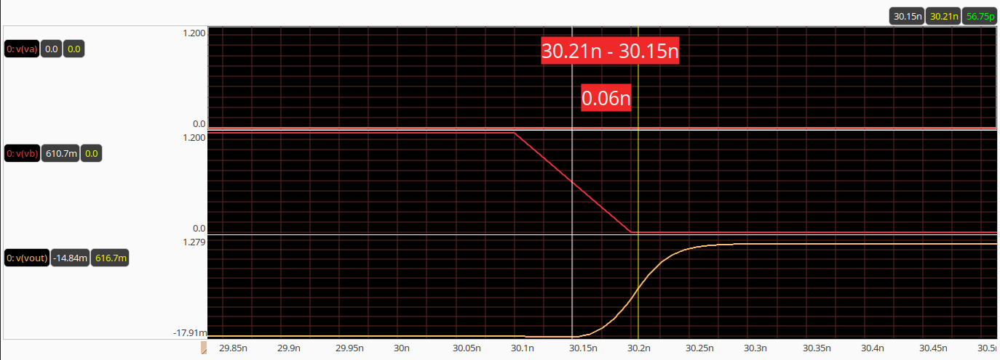 |

* **Pre-Layout $t_{pLH}$:** `40 ps`
* **Post-Layout $t_{pLH}$:** `60 ps`
* **$\Delta t_{pLH}$ (Parasitic Delay Impact):** `+20 ps`

---

#### B. High-to-Low Propagation Delay ($t_{pHL}$)
Measured when the output transitions from high to low ($1 \to 0$):

| Pre-Layout $t_{pHL}$ Waveform | Post-Layout (PEX) $t_{pHL}$ Waveform |
| :---: | :---: |
| 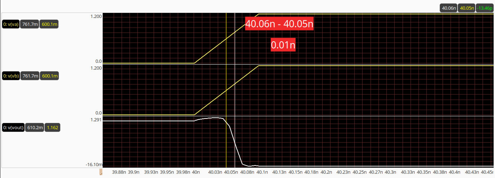 | 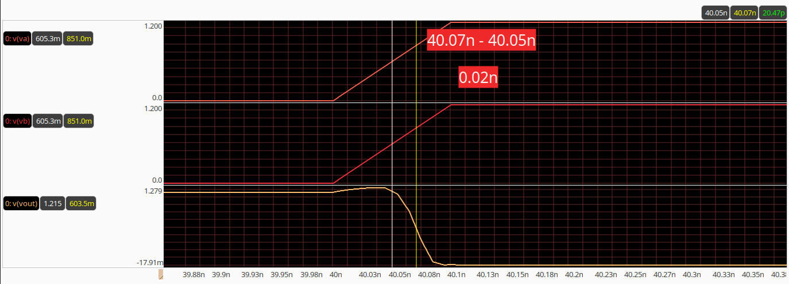 |

* **Pre-Layout $t_{pHL}$:** `10 ps`
* **Post-Layout $t_{pHL}$:** `20 ps`
* **$\Delta t_{pHL}$ (Parasitic Delay Impact):** `+10 ps`

---

#### C. Summary Timing & Characterization Table

| Timing Metric | Pre-Layout (Ideal) | Post-Layout (PEX) | Parasitic Delta ($\Delta$) | Unit |
| :--- | :---: | :---: | :---: | :---: |
| **Low-to-High Delay ($t_{pLH}$)** | `40` | `60` | `+20` | ps |
| **High-to-Low Delay ($t_{pHL}$)** | `10` | `20` | `+10` | ps |
| **Average Propagation Delay ($t_{pd}$)** | `25` | `40` | `+15` | ps |

---

## 5. 2-Input XOR Gate (`XOR2`)

The `XOR2` standard cell is implemented using a 12-transistor complementary static CMOS architecture on the IHP SG13G2 (130nm BiCMOS) node. The topology incorporates internal transmission-like and complementary inverter stages to generate inverted inputs ($\bar{A}, \bar{B}$) and realize the exclusive-OR Boolean function ($Y = A \bar{B} + \bar{A} B$).

---

### 5.1. Schematic & Physical Layout

* **Transistor Sizing:** PMOS ($W = 0.15\,\mu\text{m}, L = 0.13\,\mu\text{m}$), NMOS ($W = 0.15\,\mu\text{m}, L = 0.13\,\mu\text{m}$).
* **Physical Layout:** Full-custom layout with strict design-rule separation between gate contacts (`Cont->Gatpoly`) and active diffusion contacts (`Cont->Activ`), independent continuous supply rails ($V_{DD}, V_{SS}$), and integrated tap cells to eliminate latch-up risks.

| Transistor-Level Schematic | Full-Custom Layout (`XOR2.gds`) |
| :---: | :---: |
| 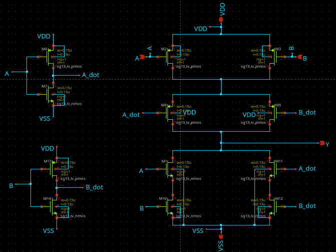 | 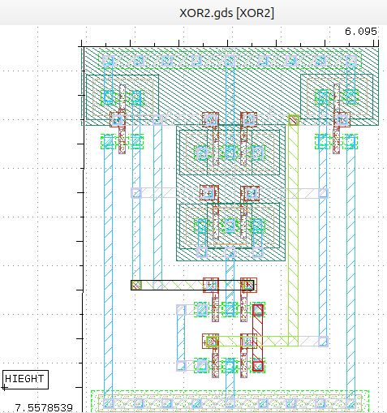 |

* **Cell Dimensions:** `[Width W] 6.095µm` × `[Height H] 7.5578539µm`
* **Silicon Area:** `[W x H] 46.06511952µm²`

#### Physical Verification (DRC & LVS)
* **DRC (Design Rule Check):** 0 errors / 100% clean verification on IHP SG13G2 rules.
* **LVS (Layout Versus Schematic):** Complete matching across all 12 transistors (6 PMOS, 6 NMOS) with zero net shorts or topology mismatches.

| DRC Clean Verification | LVS Clean Verification |
| :---: | :---: |
| 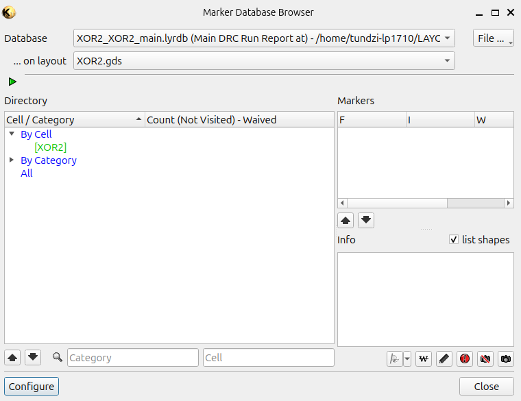 | 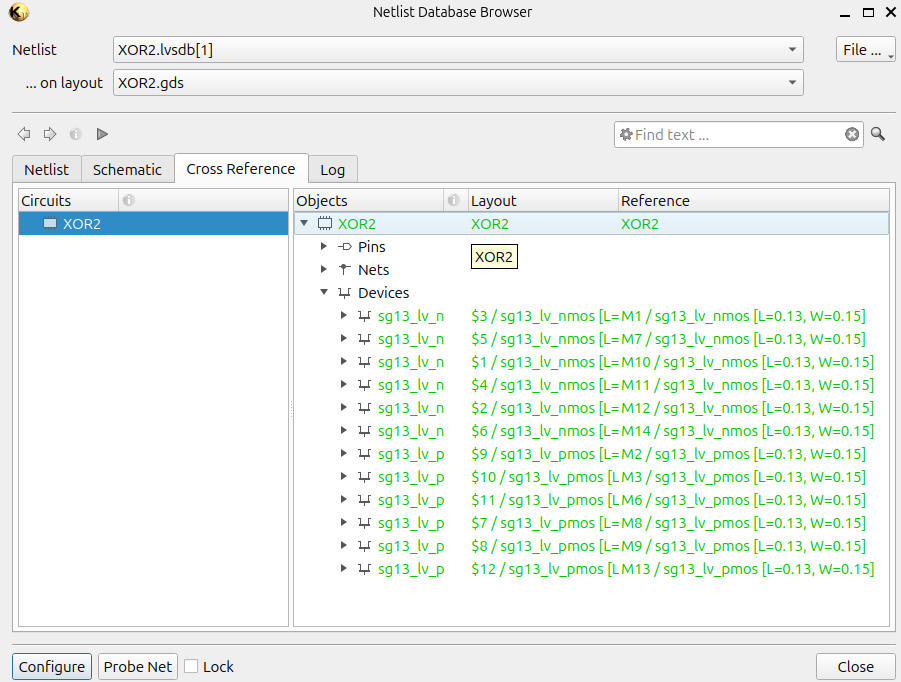 |

---

### 5.2. Pre-Layout vs. Post-Layout Testbench Setup

* **Operating Conditions:** $V_{DD} = 1.77\text{ V}$, $T = 27^\circ\text{C}$, Typical Corner (`cornerMOSlv.lib mos_tt`).
* **Input Stimuli:** 
  * $V_A$: Pulse ($0\text{ V} \to 1.77\text{ V}$, Period $= 100\text{ ns}$, Pulse Width $= 50\text{ ns}$, $t_r = t_f = 50\text{ ps}$).
  * $V_B$: Pulse ($0\text{ V} \to 1.77\text{ V}$, Period $= 50\text{ ns}$, Pulse Width $= 25\text{ ns}$, $t_r = t_f = 50\text{ ps}$).

| Pre-Layout Testbench (`TEST_PRE.sch`) | Post-Layout Testbench (`TEST_POST.sch`) |
| :---: | :---: |
| 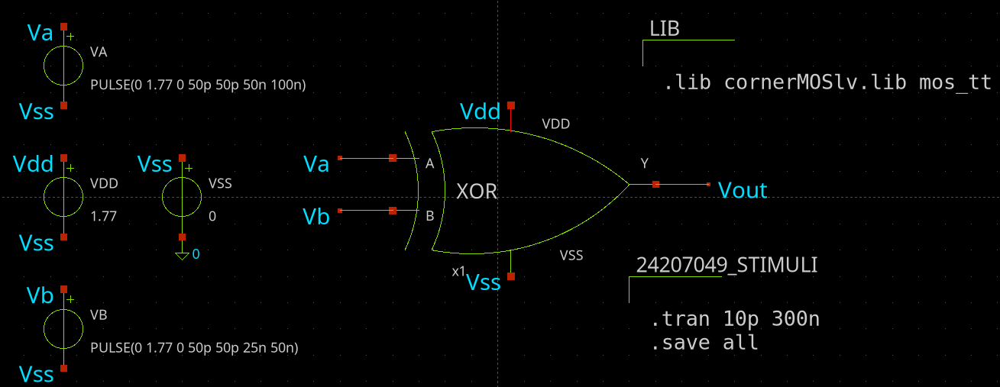 | 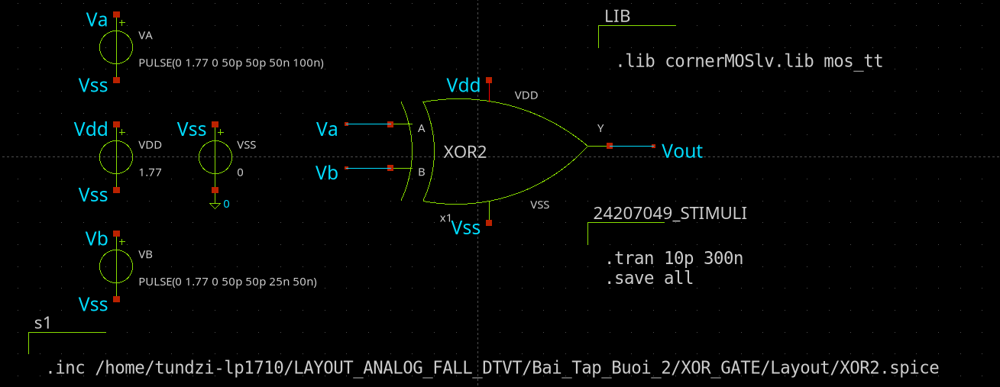 |

---

### 5.3. Transient Simulation Results

| Pre-Layout Transient Waveform | Post-Layout (PEX) Transient Waveform |
| :---: | :---: |
| 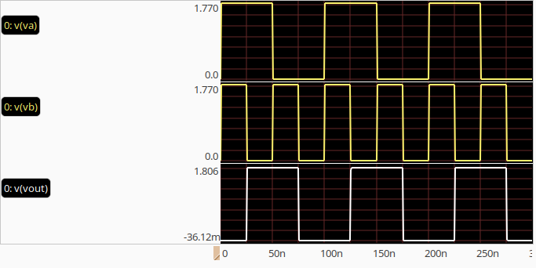 | 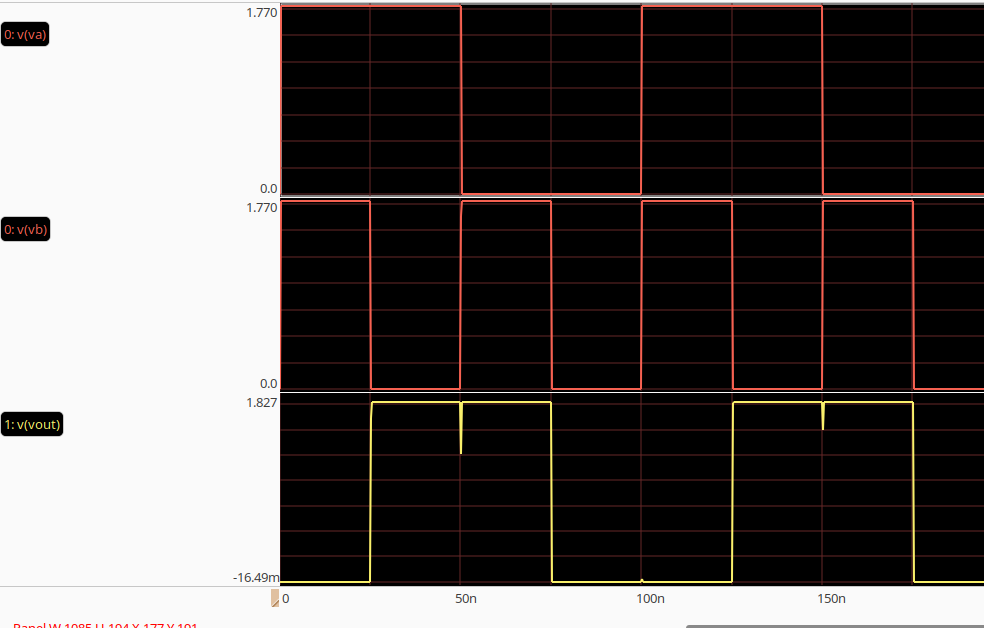 |

---

### 5.4. Propagation Delay Measurements & Waveforms

Propagation delays are extracted at the $50\%$ supply voltage crossing point ($V_{DD}/2 = 0.85\text{ V}$):

#### A. Low-to-High Propagation Delay ($t_{pLH}$)
Measured when the output transitions from low to high ($0 \to 1$):

| Pre-Layout $t_{pLH}$ Waveform | Post-Layout (PEX) $t_{pLH}$ Waveform |
| :---: | :---: |
| 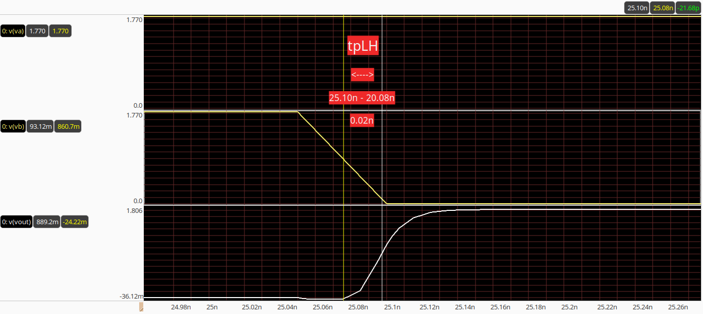 | 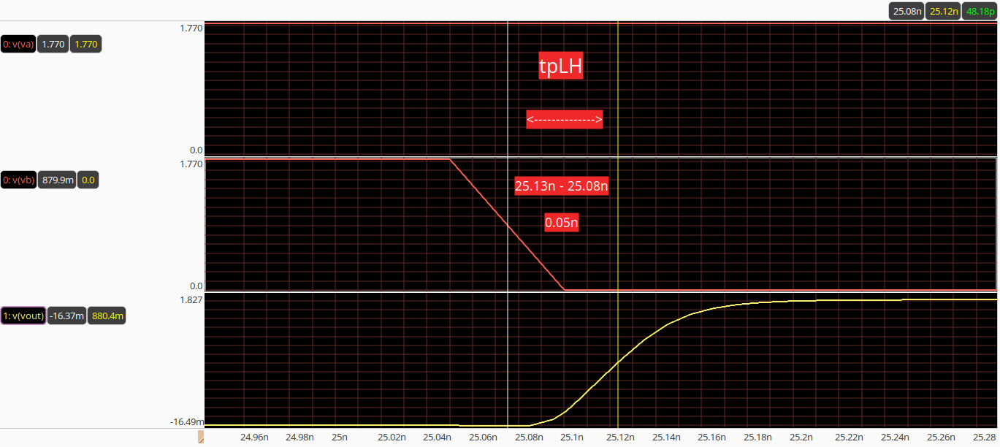 |

* **Pre-Layout $t_{pLH}$:** `20 ps`
* **Post-Layout $t_{pLH}$:** `50 ps`
* **$\Delta t_{pLH}$ (Parasitic Delay Impact):** `+30 ps`

---

#### B. High-to-Low Propagation Delay ($t_{pHL}$)
Measured when the output transitions from high to low ($1 \to 0$):

| Pre-Layout $t_{pHL}$ Waveform | Post-Layout (PEX) $t_{pHL}$ Waveform |
| :---: | :---: |
| 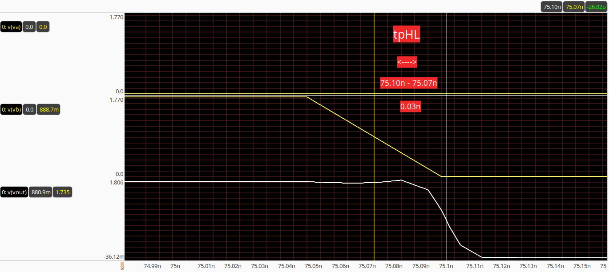 | 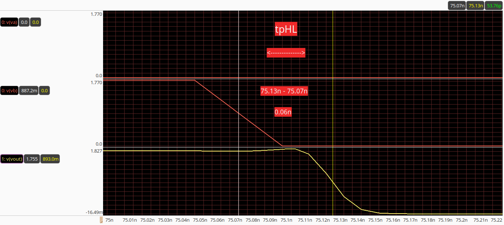 |

* **Pre-Layout $t_{pHL}$:** `30 ps`
* **Post-Layout $t_{pHL}$:** `60 ps`
* **$\Delta t_{pHL}$ (Parasitic Delay Impact):** `+30 ps`

---

#### C. Summary Timing & Characterization Table

| Timing Metric | Pre-Layout (Ideal) | Post-Layout (PEX) | Parasitic Delta ($\Delta$) | Unit |
| :--- | :---: | :---: | :---: | :---: |
| **Low-to-High Delay ($t_{pLH}$)** | `20` | `50` | `+30` | ps |
| **High-to-Low Delay ($t_{pHL}$)** | `30` | `60` | `+30` | ps |
| **Average Propagation Delay ($t_{pd}$)** | `25` | `55` | `+30` | ps |

---
