## 1. 2-Input AND Gate (`AND2`)

The `AND2` standard cell is implemented by cascading a static CMOS NAND2 gate followed by an Inverter (NOT) buffer stage on the IHP SG13G2 (130nm BiCMOS) PDK.

---

### 1.1. Schematic & Physical Layout

* **Transistor Sizing:** PMOS ($W = 0.15\,\mu\text{m}, L = 0.13\,\mu\text{m}$), NMOS ($W = 0.15\,\mu\text{m}, L = 0.13\,\mu\text{m}$).
* **Physical Layout:** Full-custom layout with continuous power rails ($V_{DD}$, $V_{SS}$) and N-well tap integration, achieving 100% DRC & LVS clean verification.

| Transistor-Level Schematic | Full-Custom Layout (`AND2.gds`) |
| :---: | :---: |
| 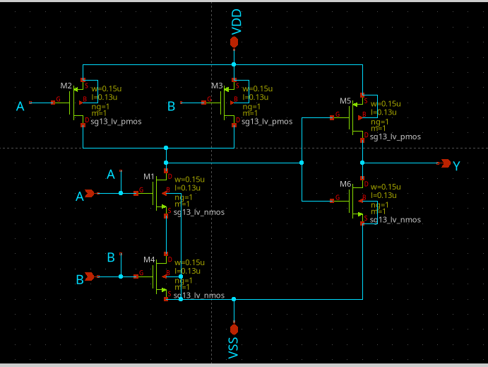 | 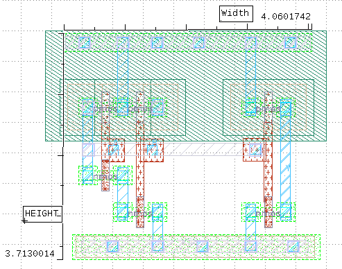 |

* **Cell Dimensions:** `[Width W] 4.060172 µm` × `[Height H] 3.7130014 µm`
* **Silicon Area:** `[W x H] 15.07542432 µm² = (15.07542432e-12)m²`

---

#### Physical Verification (DRC & LVS)
* **DRC (Design Rule Check):** 0 errors / 100% clean verification on IHP SG13G2 rules.
* **LVS (Layout Versus Schematic):** Netlists matched completely.

| DRC Clean Verification | LVS Clean Verification |
| :---: | :---: |
| 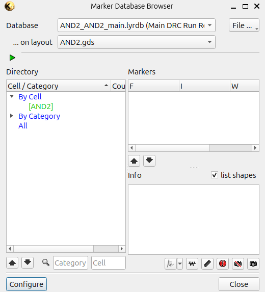 | 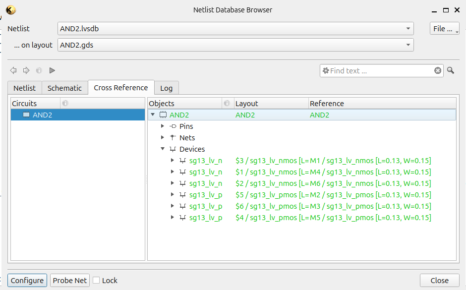 |

### 1.2. Pre-Layout vs. Post-Layout Testbench Setup

* **Operating Conditions:** $V_{DD} = 1.7\text{ V}$, $T = 27^\circ\text{C}$, Typical Corner (`cornerMOSlv.lib mos_tt`).
* **Input Stimuli:** 
  * $V_A$: Pulse ($0\text{ V} \to 1.7\text{ V}$, Period $= 20\text{ ns}$, Pulse Width $= 10\text{ ns}$, $t_r = t_f = 70\text{ ps}$).
  * $V_B$: Pulse ($0\text{ V} \to 1.7\text{ V}$, Period $= 10\text{ ns}$, Pulse Width $= 5\text{ ns}$, $t_r = t_f = 70\text{ ps}$).

| Pre-Layout Testbench (`TEST_PRE.sch`) | Post-Layout Testbench (`TEST_POST.sch`) |
| :---: | :---: |
| 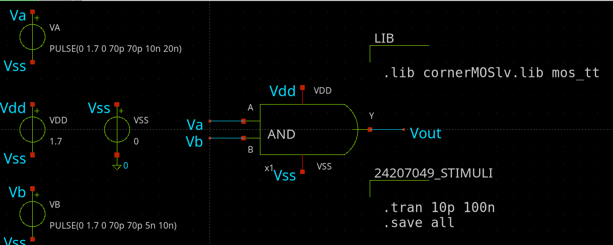 | 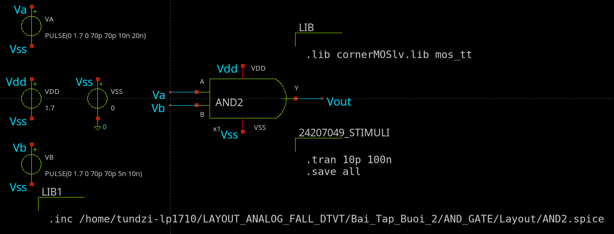 |

---

### 1.3. Transient Simulation Results

| Pre-Layout Transient Waveform | Post-Layout (PEX) Transient Waveform |
| :---: | :---: |
| 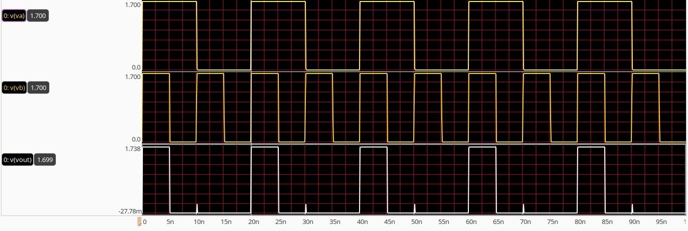 | 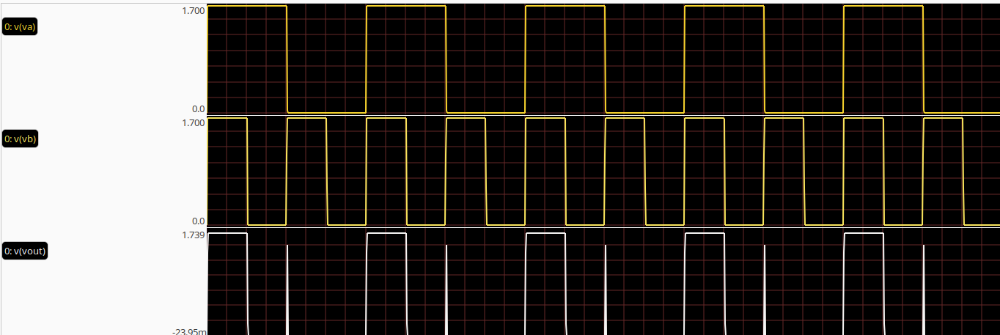 |

---

### 1.4. Timing & Propagation Delay Characterization

Propagation delays are measured at the $50\%$ logic transition threshold ($V_{DD}/2 = 0.85\text{ V}$):

#### A. Low-to-High Propagation Delay ($t_{pLH}$)
Propagation delay when output change from low - high ($0 \to 1$):

| Pre-Layout $t_{pLH}$ Waveform | Post-Layout (PEX) $t_{pLH}$ Waveform |
| :---: | :---: |
| 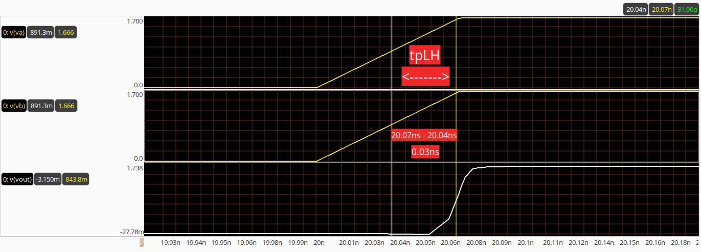 | 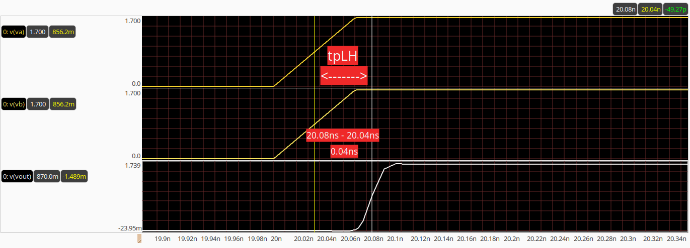 |

* **Pre-Layout $t_{pLH}$:** `30 ps`
* **Post-Layout $t_{pLH}$:** `40 ps`
* **$\Delta t_{pLH}$ (Parasitic Delay Impact):** `+10 ps`

---

#### B. High-to-Low Propagation Delay ($t_{pHL}$)
Propagation delay when output change from high - low ($1 \to 0$):

| Pre-Layout $t_{pHL}$ Waveform | Post-Layout (PEX) $t_{pHL}$ Waveform |
| :---: | :---: |
| 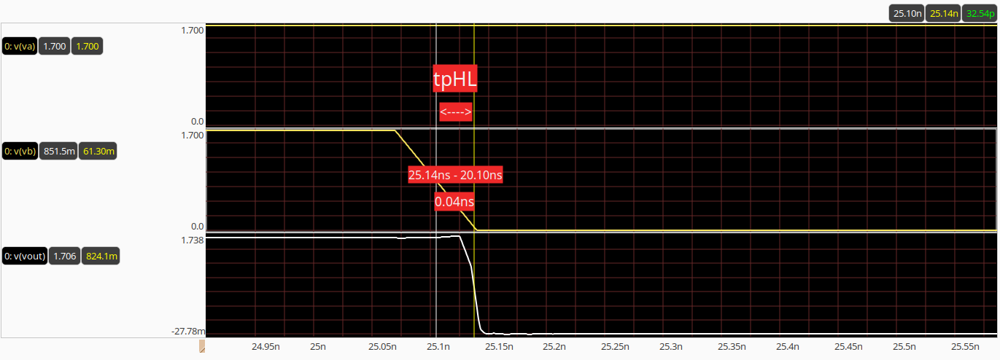 | 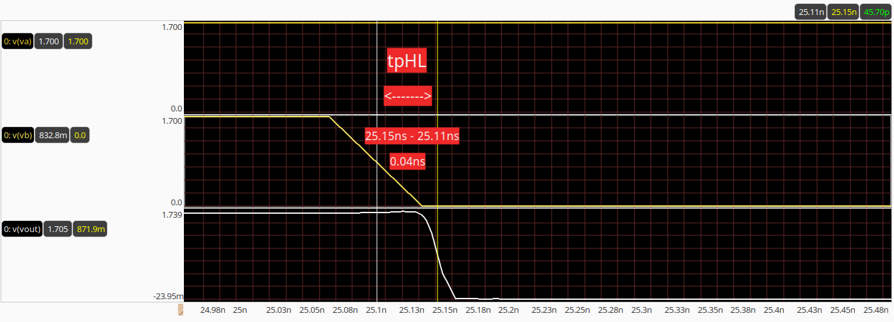 |

* **Pre-Layout $t_{pHL}$:** `40 ps`
* **Post-Layout $t_{pHL}$:** `40 ps`
* **$\Delta t_{pHL}$ (Parasitic Delay Impact):** `+0 ps`

---

#### C. Summary Timing & Characterization Table

| Timing Metric | Pre-Layout (Ideal) | Post-Layout (PEX) | Parasitic Delta ($\Delta$) | Unit |
| :--- | :---: | :---: | :---: | :---: |
| **Low-to-High Delay ($t_{pLH}$)** | `30` | `40` | `+10` | ps |
| **High-to-Low Delay ($t_{pHL}$)** | `40` | `40` | `+0` | ps |
| **Average Propagation Delay ($t_{pd}$)** | `35` | `40` | `+5` | ps |
