#Two Stage Fully-Differential OTA With CMFB (130nm BioCMOS)
1. Specifications
    - Technology: IHP SG13G2 (130 nm BioCMOS)
    - Architecture: Telescopic Cascode + Common-Source Output Stage with Common-Mode Feedback (CMFB)
    - Supply Voltage (VDD): 1.2V
    - DC Gain: > 75 dB
    - Phase Margin: > 61°
    - Unity-Gain Bandwidth > 200MHz (with Load Capacitor 2pF)
    - Slew Rate > 100V/us 
    - Output Swing > 1.0 Vpp
    - Input-Reffered Noise < 15nV/sqrt(Hz)
    - CMRR DC > 80dB
    - PSRR DC > 70dB
    - Output CM Voltage: VDD/2
    - Power Dissipation < 3mW (Entire Circuit)

2. Calculate Size of Transistors**

The transistor sizing follows the square-law design methodology under target specifications:

#### Slew Rate & Tail Current Calculation

$$I_{tail} = SR \times C_c$$

*(where $C_{c}$ is the Miller compensation capacitance, or $C_{L}$ for a single-stage load)*

#### Input Transistor Transconductance ($g_{m1,2}$) for Unity-Gain Bandwidth

$$g_{m1,2} = 2\pi \times GBW \times C_c$$

#### Aspect Ratio ($W / L$) for Differential Input Pair

$$\left(\frac{W}{L}\right)_{1,2} = \frac{g_{m1,2}^2}{2\mu_n C_{ox} I_D} = \frac{g_{m1,2}^2}{\mu_n C_{ox} I_{tail}}$$

#### First-Stage (Telescopic Cascode) Output Resistance ($R_{out1}$)

$$R_{out1} \approx \left( g_{m,casN} \cdot r_{o,casN} \cdot r_{oN,in} \right) \;\parallel\; \left( g_{m,casP} \cdot r_{o,casP} \cdot r_{oP} \right)$$

#### Second-Stage (Common-Source) Gain & Output Resistance ($R_{out2}$)

$$A_{v2} = -g_{m,CS} \cdot R_{out2} = -g_{m,CS} \cdot (r_{oN,CS} \parallel r_{oP,CS})$$

#### Overall Open-Loop DC Voltage Gain ($A_v$)

$$A_v = A_{v1} \times A_{v2} \approx (g_{m1,2} \cdot R_{out1}) \times \left[ g_{m,CS} \cdot (r_{oN,CS} \parallel r_{oP,CS}) \right]$$

#### Frequency Compensation & Stability

* Dominant Pole ($p_1$):

$$\omega_{p1} \approx \frac{1}{R_{out1} \cdot g_{m,CS} \cdot R_{out2} \cdot C_c}$$

* Non-Dominant Output Pole ($p_2$):

$$\omega_{p2} \approx \frac{g_{m,CS}}{C_L}$$

* Right-Half-Plane (RHP) Zero ($z_1$):

$$\omega_{z1} \approx \frac{g_{m,CS}}{C_c}$$

*(Nulling resistor $R_{z} \approx 1/g_{m,CS}$ is placed in series with $C_{c}$ to eliminate or shift this zero into the LHP)*

#### Common-Mode Feedback (CMFB) Loop Gain

$$A_{v,CM} \approx g_{m,CMFB} \cdot R_{out1}$$

### Schematic & Hierarchical Architecture

The operational amplifier is structured into three sub-blocks alongside the top-level testbench symbol:

| Top-Level Symbol | Bias Circuit (`BIAS`) |
| :---: | :---: |
| 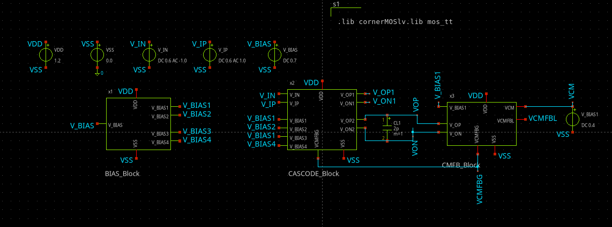 | 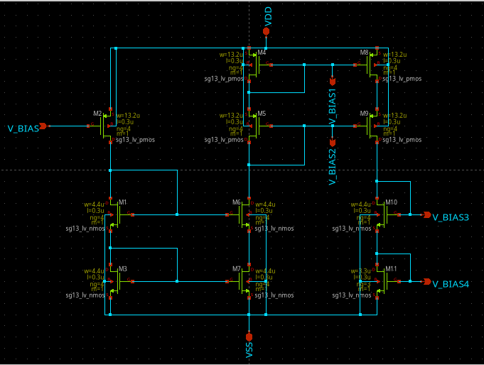 |
| **Cascode Core Stage (`CASCODE`)** | **Common-Mode Feedback (`CMFB`)** |
| 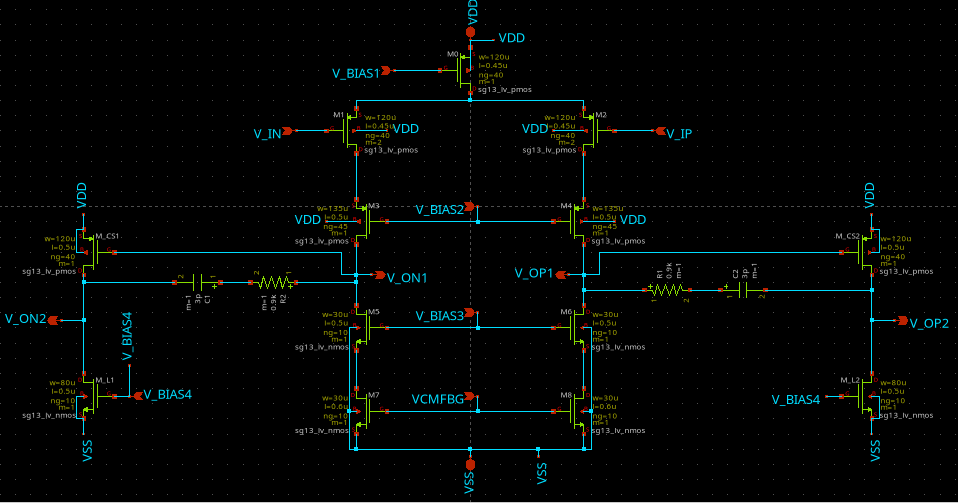 | 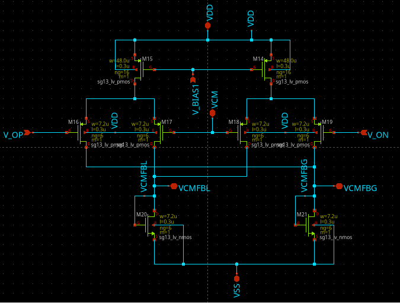 |

3. Simulation

## 3. Simulation & Performance Verification

All testbenches are evaluated using open-source EDA tools (Xschem and Ngspice) under IHP SG13G2 (130nm BiCMOS) process conditions.

---

### 3.1. DC Operating Point Analysis (`TEST_DC_OP.sch`)
* **Objective:** Verify transistor biasing and confirm all core transistors operate in the saturation region ($V_{DS} > V_{DS,sat}$).
* **Key Observations:** Checked quiescent currents across bias branches and established common-mode input/output levels.

| Testbench Schematic | DC Operating Point Table / Output |
| :---: | :---: |
| 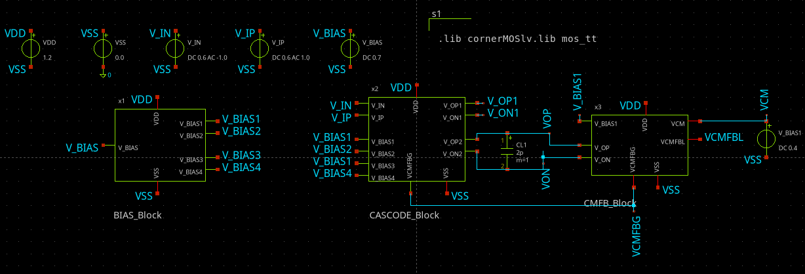 | 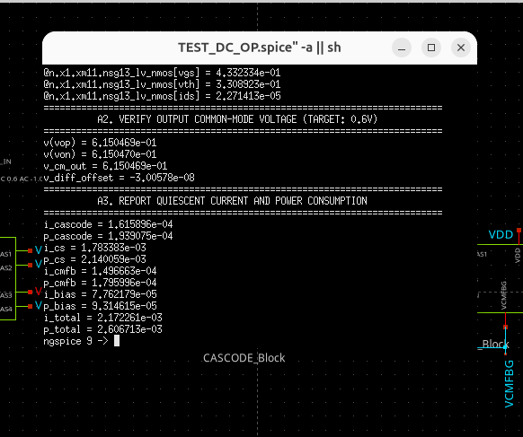 |

---

### 3.2. AC Frequency Response (`TEST_AC.sch`)
* **Objective:** Extract Open-Loop DC Gain ($A_v$), Unity-Gain Bandwidth (UGBW / GBW), and Phase Margin (PM) under load capacitance ($C_L = 2\text{ pF}$).
* **Measured Performance:**
  * **DC Gain ($A_{v0}$):** `75.3536 dB`
  * **Phase Margin (PM):** `63.0237°`
  * **Unity-Gain Bandwidth (UGBW):** `167.85MHz`

| AC Testbench | Bode Plot (Magnitude & Phase) |
| :---: | :---: |
|  | 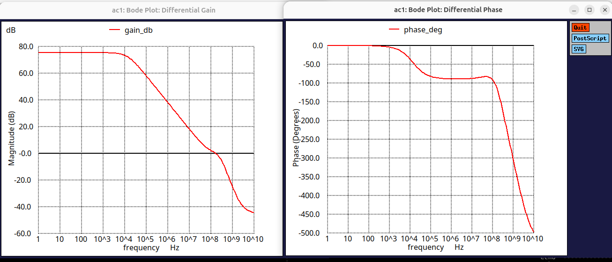 |

---

### 3.3. Transient Large-Signal Step Response & Slew Rate (`TEST_TRANS.sch`)
* **Objective:** Evaluate large-signal step response in unity-gain feedback configuration to measure Slew Rate ($SR$) and settling time.
* **Measured Performance:**
  * **Positive Slew Rate ($SR_+$):** `35.2902 V/µs`
  * **Negative Slew Rate ($SR_-$):** `35.2897V/µs`
  * **Settling Time ($0.1\%$):** `60.1564 ns`

| Transient Testbench | Step Response Waveform |
| :---: | :---: |
| 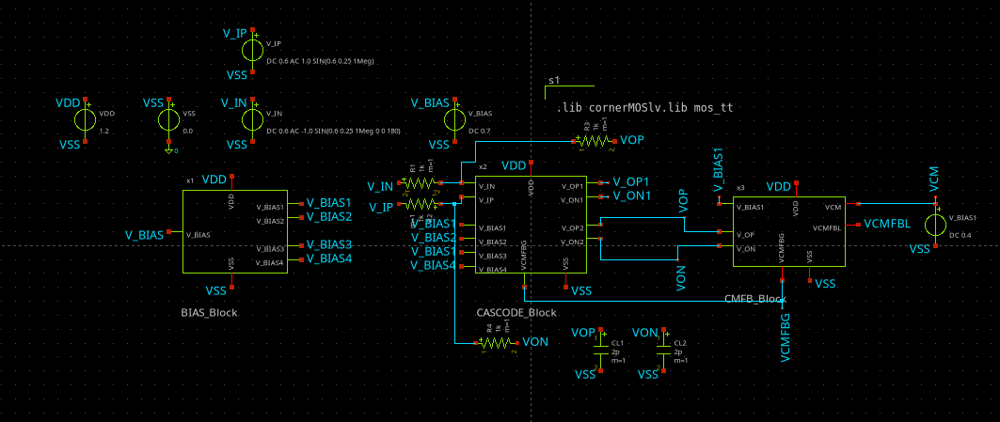 | 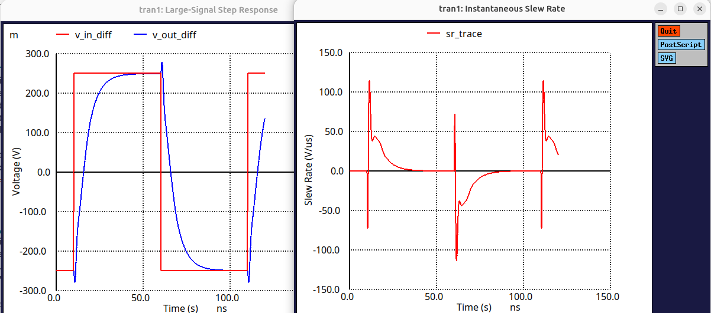 |

---

### 3.4. Dynamic Sinusoidal Response & Linearity (`TEST_SIN.sch`)
* **Objective:** Assess output swing limits and Total Harmonic Distortion (THD) under continuous sinusoidal excitation.
* **Measured Performance:**
  * **Output Voltage Swing (Differential):** `0.985014 Vp-p`
  * **THD:** `1.43756 %` @ `1MHz`

| Sinusoidal Testbench | Output Waveform & FFT Spectrum |
| :---: | :---: |
| 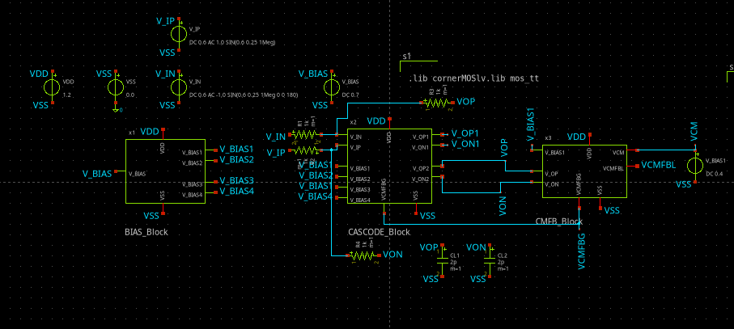 | 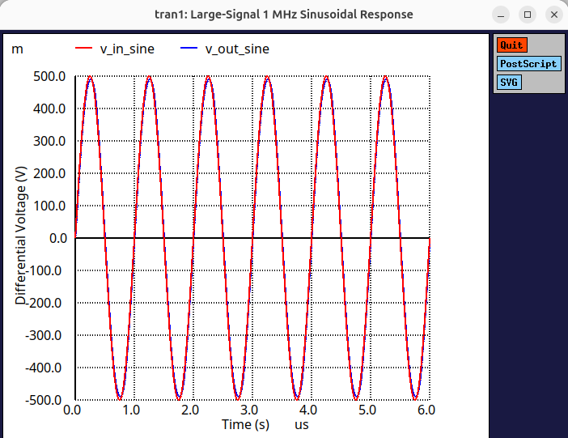 |

---

### 3.5. Common-Mode Feedback Stability (`TEST_CMFB.sch`)
* **Objective:** Validate the stability of the common-mode control loop and output common-mode voltage ($V_{OCM}$) regulation.
* **Measured Performance:**
  * **CMFB Loop DC Gain:** `71.3231dB`
  * **CMFB Phase Margin:** `99.0619°`
  * **Regulated $V_{OCM}$:** `0.615V` (Target: $V_{DD}/2$)

| CMFB Testbench | CMFB Loop Bode Plot |
| :---: | :---: |
| 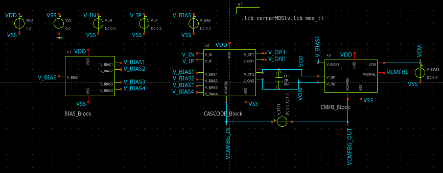 | 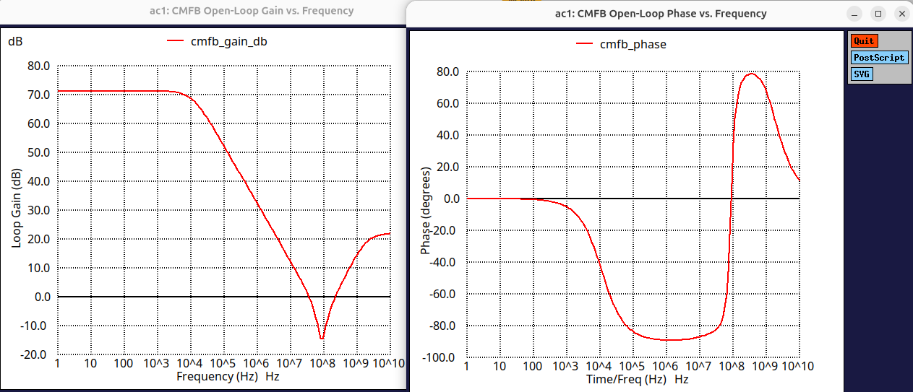 |

---

### 3.6. Noise Spectral Density (`TEST_NOISE.sch`)
* **Objective:** Characterize equivalent input-referred noise density ($S_{ni}$) and total integrated noise over the operating bandwidth.
* **Measured Performance:**
  * **Thermal Noise Floor:** `7.3688 nV/√Hz` @ `1 MHz`
  * **1/f Corner Frequency ($f_c$):** `316.2278 kHz`
  * **Integrated Input Noise:** `114.2961 µV_rms`

| Noise Testbench | Input-Referred Noise Plot |
| :---: | :---: |
| 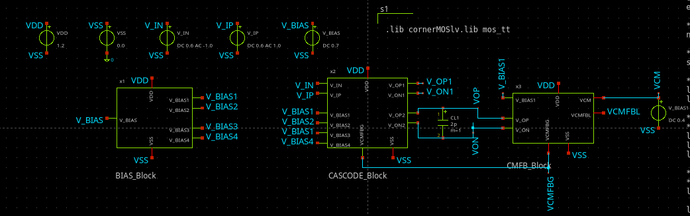 | 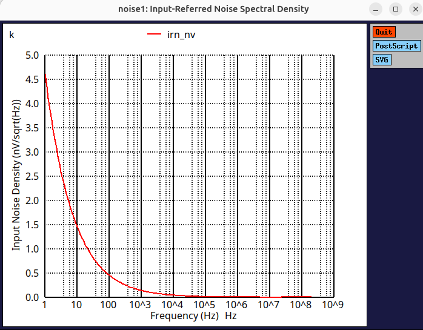 |

---

### 3.7. Process Corners Verification (`TEST_CORNER_PROCESS.sch`)
* **Objective:** Ensure circuit robustness across process variations (TT, SS, FF, SF, FS) at temperature extremes.
* **Measured Range:**
  * **Gain Range:** `67.14dB` to `79.54dB`
  * **Phase Margin Range:** `12.56°` to `86.70°`

| Corner Testbench | Superimposed AC Responses (Corners) |
| :---: | :---: |
| 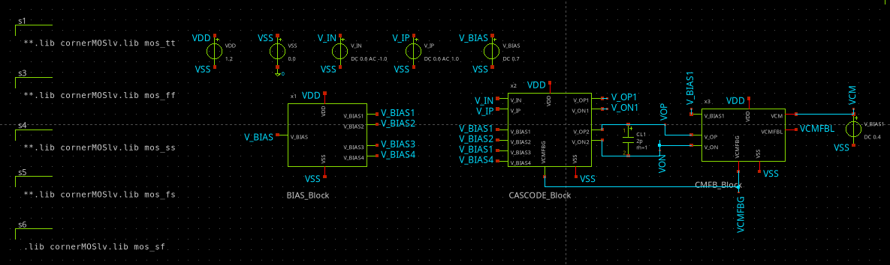 | 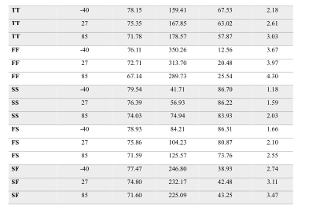 |

---

### 3.8. Monte Carlo Statistical Analysis (`TEST_MONTE_CARLO.sch`)
* **Objective:** Simulate random transistor mismatch and threshold voltage variations to observe offset voltage and gain distribution.
* **Statistical Yield:**
  * **Input Offset Voltage ($\sigma_{Vos}$):** `0.9568mV`
  * **Number of Runs:** `N = 200`

| Monte Carlo Testbench | Offset / Gain Histogram |
| :---: | :---: |
| 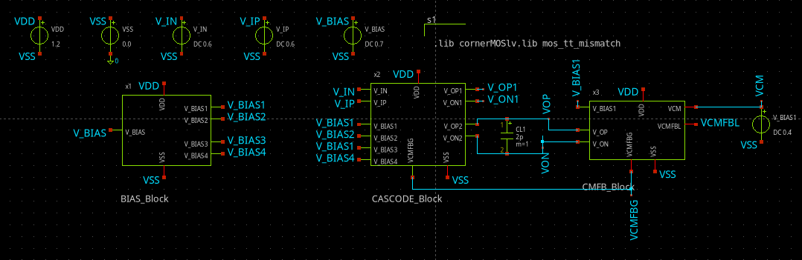 | 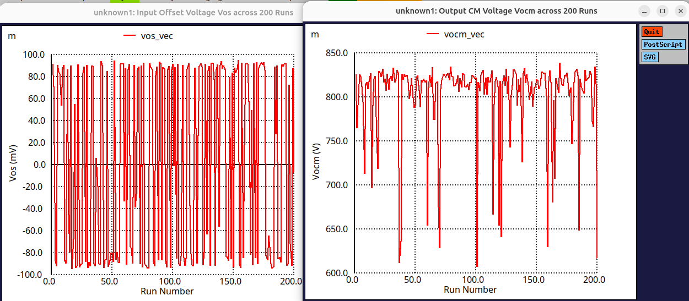 |

4. Layout & Matching Techniques

The layout implementation on the IHP SG13G2 (130nm BiCMOS) node. Each core sub-circuit is implemented, verified (DRC/LVS).

---

### 4.1. Bias Circuit Block (`BIAS_Block`)
* **Design Features:** Current mirror matching with multi-finger transistor layout and shared source/drain diffusion to establish stable reference currents.
* **Verification Status:** 100% DRC Clean & LVS Clean.

| Layout View | DRC & LVS Clean Result |
| :---: | :---: |
| 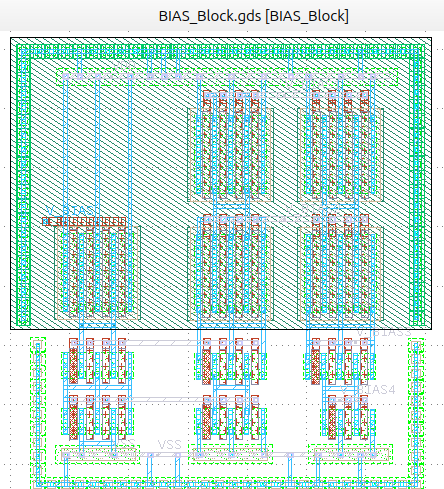 | 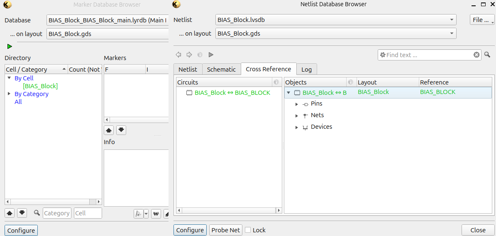 |

---

### 4.2. Cascode Core Stage Block (`CASCODE_Block`)
* **Design Features:** Differential input pair layout with symmetric routing, common-centroid/interdigitated placement, and cascode transistor stacking to optimize gain and output swing.
* **Verification Status:** 100% DRC Clean & LVS Clean.

| Layout View | DRC & LVS Clean Result |
| :---: | :---: |
| 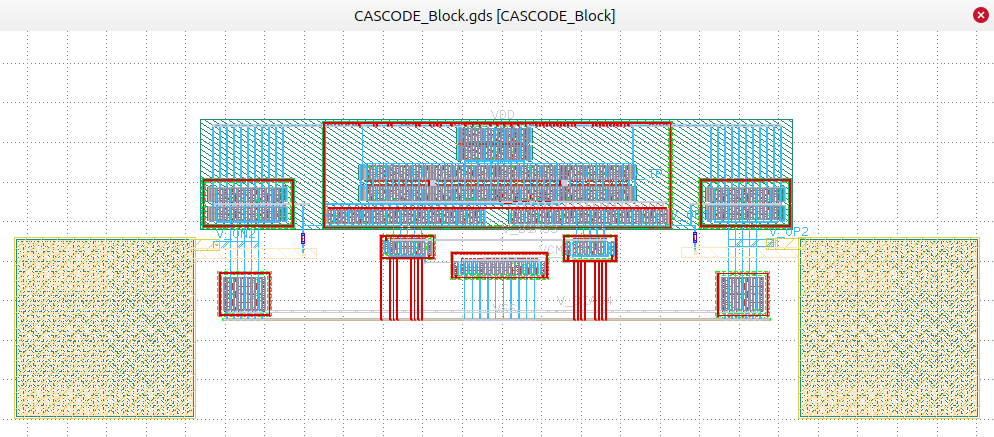 | 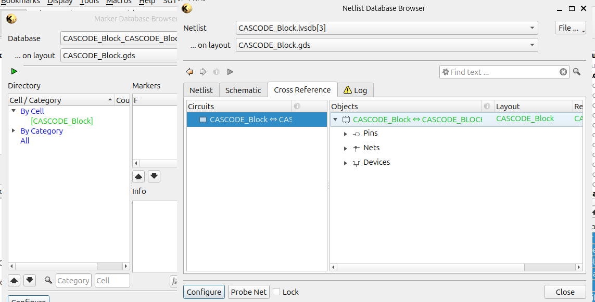 |

---

### 4.3. Common-Mode Feedback Block (`CMFB_Block`)
* **Design Features:** Differential sensing transistor matching and symmetric routing to tightly regulate the output common-mode voltage ($V_{OCM} \approx V_{DD}/2$).
* **Verification Status:** 100% DRC Clean & LVS Clean.

| Layout View | DRC & LVS Clean Result |
| :---: | :---: |
| 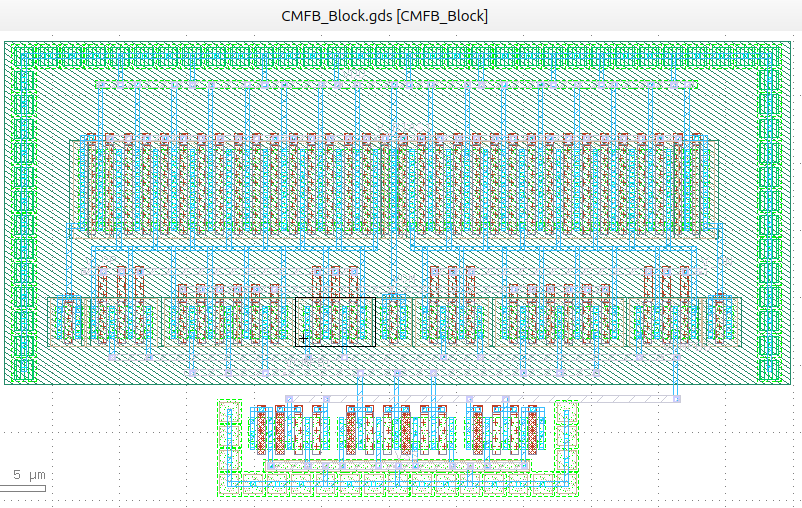 | 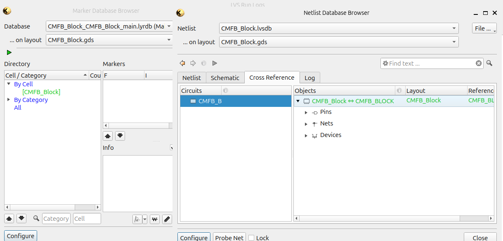 |

5. PEX (Parasitic Extraction)

Parasitic extraction was conducted via Magic VLSI using standard extraction rules (`ext2spice`) on the IHP SG13G2 PDK:
a. **Extraction Mode:** Lumped C (or RC) extraction capturing wire-to-wire capacitance and diffusion junction parasitics.
b. **Modular Netlists:** Extracted sub-circuit files (`pex_bias.spice`, `pex_cascode.spice`, `pex_cmfb.spice`) are stored in the `/pex` directory.
c. **Post-Layout Co-Simulation:** The extracted netlists replace the idealized schematic blocks to evaluate the physical circuit behavior under loaded parasitic conditions.

6. Post-Layout Simulation

Post-layout simulations were performed by co-simulating the extracted PEX netlists (`pex_bias.spice`, `pex_cascode.spice`, `pex_cmfb.spice`) within the top-level testbench schematic (`All_Block.sch`) to evaluate the impact of parasitic capacitances ($C_{wire}, C_j$) and interconnect routing.

### 6.1. Post-Layout Co-Simulation Testbench
The hierarchical testbench incorporates all three physical layout extractions to mirror real silicon behavior:

| Post-Layout Testbench Schematic | Testbench Netlist Mapping |
| :---: | :---: |
| 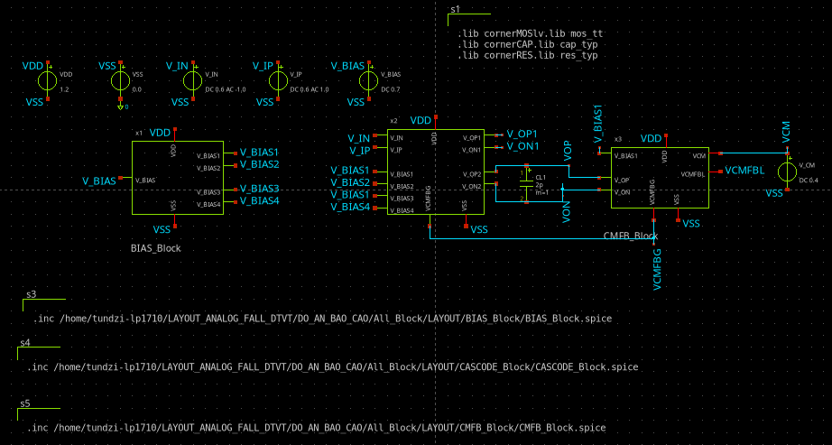 | 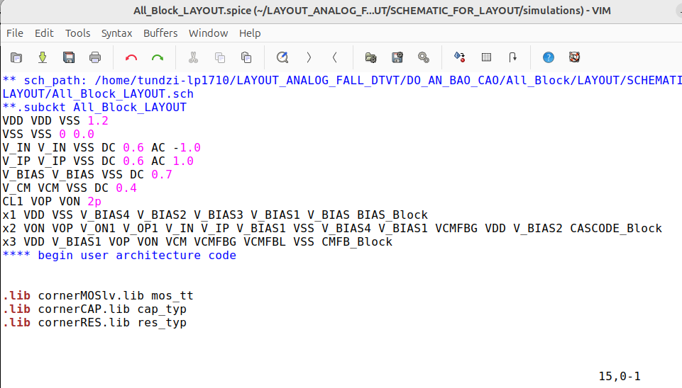 |

---

### 6.2. Pre-Layout vs. Post-Layout Performance Comparison

The table below summarizes the quantitative degradation observed after accounting for extracted parasitics under nominal conditions ($V_{DD} = 1.2\text{ V}$, $T = 27^\circ\text{C}$, $C_L = 2\text{ pF}$):

| Performance Metric | Target Spec | Pre-Layout | Post-Layout | Variation ($\Delta$) |
| :--- | :---: | :---: | :---: | :---: |
| **DC Gain** | $\ge 75\text{ dB}$ | $75.3536\text{ dB}$ | $75.3445\text{ dB}$ | $-0.0091\text{ dB}$ |
| **Gain-Bandwidth** | $\ge 200\text{ MHz}$ | $167.961\text{ MHz}$ | $154.607\text{ MHz}$ | $-13.354\text{ MHz } (-7.95\%)$ |
| **Phase Margin (PM)** | $\ge 60^\circ$ | $63.0044^\circ$ | $61.8106^\circ$ | $-1.1938^\circ$ |
| **Total Power** | $< 3.0\text{ mW}$ | $2.6067\text{ mW}$ | $2.6047\text{ mW}$ | $-0.0020\text{ mW}$ |
| **Output Common-Mode** | $= 0.60\text{ V}$ | $0.6150\text{ V}$ | $0.6157\text{ V}$ | $+0.7\text{ mV}$ |
| **Referred Noise @ 1MHz** | $< 15\text{ nV}/\sqrt{\text{Hz}}$ | $7.4926\text{ nV}/\sqrt{\text{Hz}}$ | $7.4944\text{ nV}/\sqrt{\text{Hz}}$ | $+0.0018\text{ nV}/\sqrt{\text{Hz}}$ |
| **CMRR DC** | $> 80\text{ dB}$ | $100.85\text{ dB}$ | $100.76\text{ dB}$ | $-0.09\text{ dB}$ |
| **PSRR DC** | $> 70\text{ dB}$ | $206.07\text{ dB}$ | $158.47\text{ dB}$ | $-47.60\text{ dB}$ |
| **Slew Rate (SR)** | $> 100\text{ V}/\mu\text{s}$ | $50.3686\text{ V}/\mu\text{s}$ | $48.7191\text{ V}/\mu\text{s}$ | $-1.6495\text{ V}/\mu\text{s}$ |
| **Differential Swing** | $> 1.0\text{ V}_{pp}$ | $1.4066\text{ V}_{pp}$ | $1.3867\text{ V}_{pp}$ | $-0.0199\text{ V}_{pp}$ |
---

### 6.3. Waveform Comparison (Pre vs. Post Layout)

Overlay waveforms highlight the frequency roll-off and parasitic loading effects:

| AC Frequency Response (Bode Plot) | Transient Step & Slew Rate |
| :---: | :---: |
| 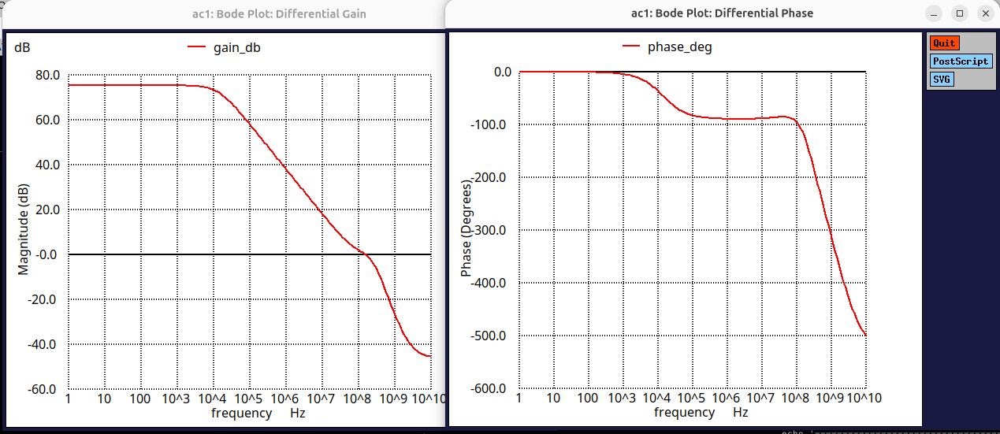 | 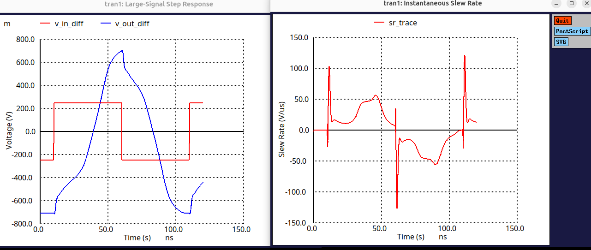 |

